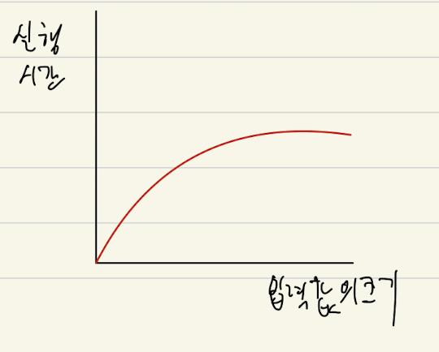

# 알고리즘이란?
- 문제를 해결하는 최선의 선택
- 컴퓨터는 어떻게 최선의 수를 찾을까?
- 컴퓨터는 어떻게 문제를 해결할까?
- 이것에 대한 고민 및 고민의 결과가 알고리즘이다.

# 의사코드란?
- 코드작성 전 우리가 쓰는 언어로 프로그램 작동논리를 먼저 작성하는 것

## 의사코드 작성 목적
- 사람은 경험을 통해서 학습한 것이 있기 때문에, 어떤 행동을 함에 있어, 생략을 할 수 있다.
- 하지만 컴퓨터는 처음부터 끝까지 모든걸 알려줘야 하기때문에, 우리의 사고방식과 맞지않다.
- 그렇기 때문에, 컴퓨터적 사고를 위해 의사코드를 작성해야 한다.

## 의사코드 작성의 이점
- 시간이 단축된다.
    - 단순한 논리는 의사코드를 작성하는 시간이 더 들겠지만, 복잡한 문제일 경우, 문제안에 다양한 논리가 구현이 되고, 서로 연결되어야한다.
    - 그때, 놓친 기능의 발생이나, 머리에 있던 논리를 까먹어서 다시 생각해야하는 과정을 줄일 수 있다.
- 디버깅에 유리하다.
    - 위 장점에서 만약 디버깅 시 원하는 출력값이 나오지 않았는데, 의사코드가 있다면, 어떤 기능이 누락되어 오류가 나왔는지 찾기 쉽다.
- 비개발자와 소통에 유리하다.

## 의사코드 작성법
- 의사코드 작성은 사람마다 다 다르지만, 나의 경우는 앞으로 이런 규칙으로 의사코드를 작성 하겠다.
1. 구현하고자 하는 것에 전반적 설명, 조건, 예외 등을 맨 앞에 적는다.
2. 클래스 -> 필드 -> 메서드시그니쳐 -> 메서드 바디 순서로 필요한 것을 글로 쓴다.
3. 한줄씩 필요한 논리를 쓰고, 바로 아래 코드로 구현한다.->오류가 있을 시 찾기 수월함을 위해
4. 조건문이 필요할 시 조건을 자연어로 쓰되, if, for, while 안에 자연어로 쓴다.
```java
// 정수형 배열을 받아 짝수가 몇개 인지 리턴하는 메서드 작성시

// 문제 개요
// 정수형으로 된 배열이 인자값으로 전달된다.
// 배열이 전달되면, 각 인덱스에 요소가 짝수인지 검사한다.
// 짝수면, 카운팅 해뒀다가, 배열에 대한 검사를 모두 마치면, 카운트를 반환한다.

// 의사코드
// 1. int형 배열을 인자로 받고, 반환을 int로 하는 메소드 시그니쳐가 필요하다.
public int isEven(int[] arr){

    // 2. 짝수일때, 1씩 증가할 카운팅 변수가 필요하다.
    int count=0;

    // 3. 배열 전체를 검사해야하기 때문에 for(인덱스용 변수 ; 인덱스용 변수<배열의크기;증가)의 반복문 작성
    for(int i =0;i<arr.length;i++){

        // 4. 짝수인지 파악하는 조건문-> if(배열의 i번째요소%2의 값이 0이면 짝수)
        if(arr[i]%2==0){

            // 5. 카운트 증가
            count++;
        }
    }
    //6. 결과 반환
    return count;
}

```
# 시간복잡도
## 정의
- 문제를 푸는것만큼 중요한 것은 `효율적으로 푸는 방법을 고민하는 것`이다.
- `효율성을 고려하는 것은 시간 복잡도를 고민`한다는 말과 같다.
- 알고리즘의 성능을 수학적으로 표현해주는 표기법
- 알고리즘의 시간과 공간복잡도를 표현할 수 있다.
- 데이터나 사용자의 증가에 따른 `알고리즘의 성능을 예측하는 것`이 목적이다.

## Big-O 표기법
- 알고리즘의 시간 복잡도를 표기하는 방법
- input 값의 변화에 따라 연산을 실행할때 실행시간의 변화를 파악할 수 있다.

## 종류
- Big-O  (최악의 경우 가정)
- Big-오메가  (최선의 경우 가정)
- Big-세타  (중간,평균의 경우 가정)
    - 이 중 Big-O = 최악의 경우를 가정해서 프로그램을 짠다.
    - `최선이나 중간의 상황을 고려해서 프로그램을 짜면, 최악의 경우 문제 파악할 범위가 커지기 때문이다.`

## Big-O 표기법의 예시

## O(1)=constant complexity
- 입력값이 증가해도 실행 시간이 늘지 않는다.
- 실생활:
    - 컵라면에 물을 붇고 익히는데 까지 3분 걸리는 작업을 한다고 하면,
    - 라면이 아무리 많이 넣어도 한개를 완료하는데는 3분 걸린다.
    <br></img><br/>

## O(n)=linear complexity
- 입력값이 증가할때, 실행시간이 똑같은 비율로 증가한다.
- 실생활:
    - 휴게소에서 핫바를 전자레인지에 3분 데워서 손님 모두에게 주는 것까지 한작업이라하자
    - 아까는 라면이 익는데 까지 였다면, 이번엔 매장에 온 손님 모두에게 서빙을 마쳐야한다.
    - 그럼 10명이 대기한다면, 3분 x 10명 =30분이 걸린다. n명이면, 3n분이 걸린다.
    - 즉, 일정 간격으로 실행시간이 증가한다. 3(1명), 6(2명), 9(3명) ..... 3n(n명)
    <br></img><br/>

## O(log n)=logarithmic complexity
- O(1)다음으로 빠른 시간 복잡도를 가짐
- 실행할때마다 작업해야하는 데이터가 절반으로 준다.
- 실생활:
    - 술자리에서 up&down 게임을 한다고 할때, 맞추는 데 까지 걸린 시간을 작업시간으로 하자
    - 주최자가 제시한 범위의 절반만 얘기하면, 최소의 시간이 걸릴 것이다.
    - 즉 1부터 100까지 범위에서 67을 찾으려면 50(1회) 75(2회) 63(3회) 69(4회) 66(5회) 67(6회) 이렇게 절반씩 범위를 좁혀나가는 것이다. 
    <br></img><br/>

## O(n^m)=quadratic complexity
- 입력값이 증가함에 따라 시간이 m의 제곱수 비율로 증가
- 쉬운 사례로는 for문이 두번 중첩됐을때를 생각할 수 있다.
- 만약 m번 중첩된다면 O(n^m)가 된다. 
- 실생활:
    - 00편의점 도시락은 쌀, 나물, 튀김으로 구성되어 있다.
    - 쌀은 세척, 측량, 담기 과정을 거쳐에 도시락에 담긴다.
    - 나물은 세척, 측량, 담기 과정을 거쳐 도시락에 담긴다.
    - 튀김은 세척, 측량, 담기 과정을 거쳐 도시락에 담긴다.
    - 모든 작업은 2분이 걸린다. 그럼 하나의 도시락이 포장 되려면 얼마의 시간이 걸릴까?
    - 쌀이 도시락에 담기는 시간 2*3
    - 나물이 도시락에 담기는 시간 2*3
    - 튀김이 도시락에 담기는 시간 2*3
    - 완성 까지 2*3*3 여기서 상수인 2분은 데이터에 변화에 따른 시간의 변화율에 영향을 안주기 때문에, 3*3이 걸린다. 
        <br></img><br/>

## O(2^n)=exponetial complexity
- Big-O 표기법 중 가장 느린 시간 복잡도
- 쉬운 사례로는 피보나치 수열이 있다.
- 실생활:
    - 실제로는 없지만, 강아지는 임신을 하게되면 무조건 2마리씩 낳는다고 할때,
    - 한마리가 태어나는 시간을 한단위의 실행시간이라고 하자.
    - 자손들은 언제나 한마리씩 임신해서 두마리씩 낳는다고 가정한다.
    - 이때, 이 강아지의 5대가 태어나는 시간은 얼마나 걸릴까?
    - 1대 -> 1일+1일, 2대 -> 1일+1일+1일+1일, 3대 -> 1일+1일+1일+1일+1일+1일+1일+1일
    - 즉, 2의 제곱만큼 시간이 늘어남을 알 수 있다. 
        <br></img><br/>