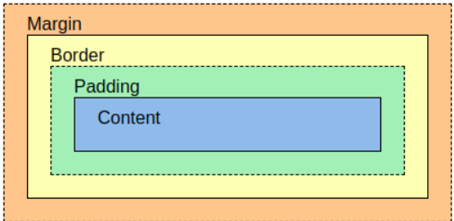
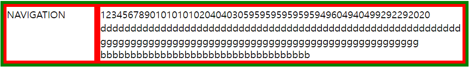

# BoxModel
- 박스 모델이란, 각 태그가 갖고 있는 영역의 크기를 조정하는 것이다.

- 각 태그의 box는 그림과 같이 생성된다.
- 각 영역의 의미
  - content: 내용이 갖는 영역
  - padding: border와 content 사이 간격
  - border: box 선의 굵기
  - margin: 다른 태그와 간격
- 영역별 주요 속성
  - content
    - `width: 숫자px`= content 영역의 크기를 조정(글자 크기가 아니다.)한다.
  - padding
    - `padding: 숫자px` = border와 간격을 조정한다.
  - margin
    - `margin: 숫자px` = 태그간 간격을 조정한다.
  - border
    - `border-width:5px` = border 두께 조정
    - `border-color: red` = border 색상 조정
    - `border-style: solid` = border 모양
    - `display: inline` = box의 속성을 선택. inline(딱 콘텐츠 만큼만)/block(그 행 전체)/grid(타 태그와 같은행에 배치)
  - 모든 영역에서 top, right, bottom, left에 대한 설정을 `영역이름 + -`후 방향을 쓰면, 그 방향만 수정이 가능하다.<br><br> 
# Grid
- grid는 다음 그림과 같이, 다른 태그가 한 행에 나열되게 해준다.<br>

- grid를 위해서는 태그 선언중 `display:grid`가 선행되어야한다.
- 이후, `grid-template-columns: 150px 1fr` 형태로 선언해야한다.
  - 이때, 열/행 형태로 나열할지는 columns(열)/row(행)의 속성이 있다.
  - 또한, 각 태그의 content 크기를 정하기 위해서는 `px`과 `fr` 옵션이 있는데,<br>px은 고정값, fr은 변동값이다.

- 끝으로, grid를 하기 위해서는 다른 태그를 `<div>`로 그룹화해야 한다.

# Mediaquery
- mediaquery는 화면의 크기에 따라 어떤것이 사라졌다, 나타났다를 할 수 있게 한다.
- 사용 할때는 다음과 같이 @media(조건)안에 적용할 태그 및 속성을 기입하면 된다.
    ```CSS
          @media(max-width:800px){
        div{
          display:none;
        }
      }
    ```

## 참고 및 연습
W3C: <a href="https://www.w3schools.com/css/exercise.asp?filename=exercise_boxmodel3" target="_blank">W3C CSS연습</a>
<br>
셀렉터 연습: <a href="https://codestates.github.io/sw-checkpoint-css-selector-deploy/" target="_blank">셀렉터 연습</a>