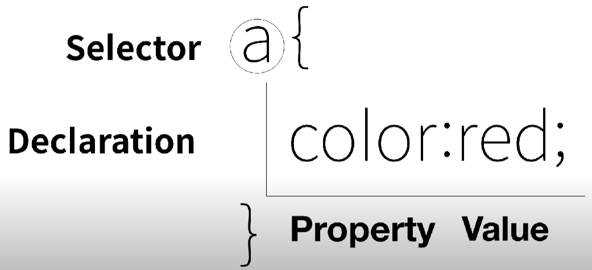

# CSS를 왜 쓸까?
- CSS에 대해서 알아보기 전에 CSS를 왜쓰는지 알아보자.
  - HTML은 정보를 담고, CSS는 꾸미는 역할을 한다.
    - HTML은 중복되는 내용을 한번에 실행 시켜주는 방법이 없다.<br>
    이로 인해 코드가 불필요하게 길어지거나, 트래픽이 늘기 때문에,   
    CSS를 사용한다.
<br><br>
# 선택자, 선언, 속성, 값
- CSS는 HTML의 `<head>`->`<style>` 태그 안에서 작성한다.
<br>
- 다음 그림을 보면서, 선택자, 선언, 속성, 값에 대해 이해해보자.

<br>
- 선택자는 스타일에 변동을 주고 싶은 태그를 의미한다.
- 선언은 지정한 태그에 어떤 변화를 준다는 것을 명시한다.
- 속성은 구체적으로 어떤 변화(색, 폰트 크기, 박스크기 등)를 줄지 의미한다.
- 값은 속성마다 줄 수 있는 것이 다르며, 속성에 대해 구체적인 값을 제시한다.
<br><br>


# 선택자 advanced
- 앞서, CSS를 사용하는 배경으로 중복 작업을 막아주기 때문이라고 했다.
- 하지만, 선택자가 무엇이든 일괄적으로 처리한다면, 방문한 흔적을 남기는 것과 같 
이 구분되어야할때도 일괄처리를 할 수 있다.
- 따라서, 여기서는 다양한 선택자 지정방법을 배워보자.
## 1. class
- 1반, 2반, 3반 학급을 나누듯이 태그도 분류를 시킬 수 있다.
    ```css
    h1{
        color:black;
    }
    .saw{
        color:red;
    }
    '''''''''''''''''''''''''''
    <h1>CSS</h1>
    <h1 class="saw">JAVA</h1>
    <h1 class="saw">C++</h1>
    ```
- 위와 같이 JAVA와 C++의 `<h1>`태그에 `class="saw"`를 선언하고, `<style>` 태그 내에서 `.클래스명`을 기입한다.
- 그러면, CSS는 검정색, 나머지는 red로 나온다.

## 2. id
- id는 한국어에서, 민증, 학번 등과 같은 고유번호를 의미한다.
    ```css
    h1{
        color:black;
    }
    .saw{
        color:red;
    }
    #article{
        color:blue;
    }
    '''''''''''''''''''''''''''
    <h1>CSS</h1>
    <h1 class="saw">JAVA</h1>
    <h1 class="saw" id="article">C++</h1>
    ```
- 위와 같이 C++에 `id="article"`이라는 id를 부여하고, `#id명`을 선언하면, CSS는 검정색, JAVA는 빨강색 C++은 파랑색이 나온다.

## 3. `<div>`
- `<div>`태그는 다른 태그를 그룹화시키는 역할을 한다.
    ```CSS
    div{
        color:black;
    }
    ''''''''''''''''''''''''''''''''''''''''''''''''''''''''''''
    <div>
      <h2>CSS</h2>
      <p>
        HTML 등의 마크업 언어로 작성된 문서가 실제로 웹사이트에 표현되는
        방법을 정해주는 스타일시트 언어.
        CSS의 C가 Cascading[1]의 약자인데, 이는 상위 요소의 스타일 속성을 자손 요소
        들에게 상속시켜주는 모습이 DOM 트리구조에서 마치 폭포수처럼 내려가는
        모습을 닮았기 때문이다. 다만 예외로 마진, 패딩, 보더 등의 박스모델 관련
        속성은 상속되지 않는다. 물론 inherit 값을 줘서 강제로 상속시킬 순 있다.
      </p>
    </div>
    ```
- 예시 처럼 실행하면, `<p>` 태그와 `<h2>` 태그가 div로 묶여 두 태그 안에 내용이 모두 검정색이 된다.
- 이때, `<div>` 태그도 id나 class를 부여할 수 있다.

## 4. etc
- 끝으로, 일반 선택자, id, class는 우선순위가 있다.
- 우선순위는 id>class>일반 선택자 순이다.