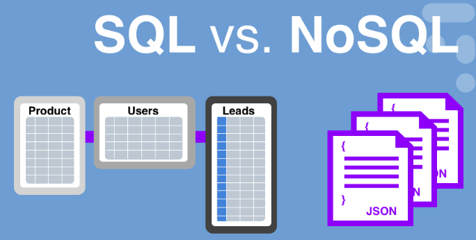
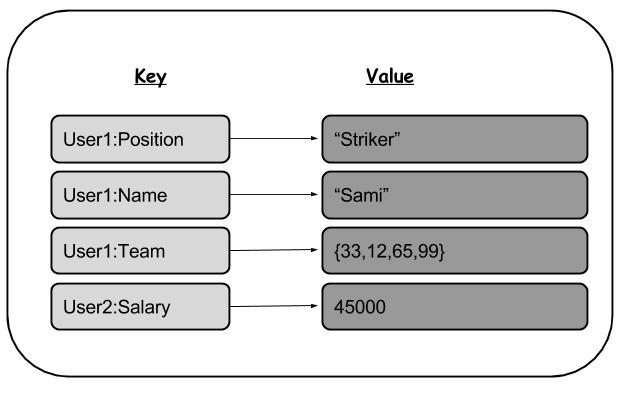
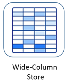
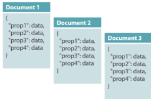
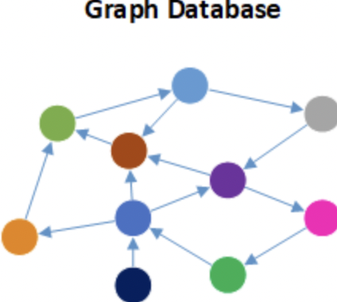

# 데이터베이스
- 데이터가 어디에 저장해 있는 곳
- 한 곳에 저장된 데이터가 OS에 독립적으로 사용되는 것

## DBMS
- DBMS는 데이터를 창고처럼 넣고 빼는 창고

## SQL
- 표형태의 데이터를 CRUD에 맞게 조작하는게 SQL이다.
    - DBMS라는 창고를 넣다, 뺐다, 삭제하는 SQL이 자판기의 제어판 같은 역할을 한다.

## mySQL
- excel 표처럼 데이터를 저장한다.
- 데이터 형태가 달라서 생기는 오류가 예방된다.

## RDBMS = 관계형데이터베이스
- 관계형 데이터 베이스는 엑셀과, 일반 폴더에 저장된 텍스트파일과 비교하면 이해과 쉽다.
    - 엑셀에 3학년 내신성적표 관리가 있다.
    - 이 표에는 학년, 학번, 이름, 과목별 성적, 등급이라는 칼럼(열)이 있다.
    - 이 열에 들어가는 값들 예를들어 학년->숫자, 학번->숫자, 이름->문자 등등 이라는 형식이 정해져 있을 것이다.
    - 이와 반대로, 엑셀처럼 안에 데이터를 안정하고, 기입하는 일반 폴더에 성적관리 텍스트 파일이 있다.
    - 여기에는 열에 데이터 형태가 틀려도, 오류에 대한 안내가 없다. 이렇게 되면, 1반 선생님, 2반 선생님 등등이 다 기입을 통일성 있게 못해서, 추후 데이터를 활용하기가 매우 어렵다.
    - `관계형데이터베이스는 예로든 엑셀과 비슷하다. 개발자는 스키마를 통해서, 열과, 열에 형식, 기본키, 외래키 등을 정해놓고, 사용자가, 관련있는 테이블을 가져오거나, 새로 레코드를 기입할때, 더 편리하고, 수정에 따른 데이터의 오류를 사전에 예방하는 데이터베이스다.`
`
# RDBMS vs NoSQL
 </img> 

## NoSQL

- 앞에선 관계형데이터베이스에 중점을 두고, 공부했다면, 여기서는 NoSQL에 중점을 두고 보자.
- 우선 `NoSQL은 특정하게 정해진것이 아니라, SQL외에 데이터를 관리하는 데이터 베이스라고 기억해야한다.`
- NoSQL은 일상 사례로 일반 폴더에 텍스트 파일형태로 데이터를 저장하는 것을 예로 든 것처럼 규칙없이 데이터를 저장한다는 것만 기억하자.
- 앞서, SQL이 아닌 것을 NoSQL이라고 한 이유는 다양한 NoSQL이 있기 때문이고, 크게 4가지로 카테고리화 된다.

## NoSQL 종류
### Key-Value 타입 : 
 </img> 

- 그림에서 볼 수 있듯 속성을 `Key-Value 쌍으로 나타내는 데이터를 배열의 형태로 저장한다.` 이때, Key는 속성 이름을 뜻하고, Value는 속성에 연결된 데이터 값을 의미한다.

### Wide-Column 데이터베이스 : 
 </img> 
- 데이터베이스에서 열에 대해서 Key-Value가 `1대1이 아닌` `1대 다`로 저장되는 형태이다. 이때, Key와 다수의 Value를 컬럼 패밀리라고 한다. 하나의 행에 많은 열을 포함할 수 있어서 데이터 관리에 유연성이 크며, `규모가 큰데이터를 분석하기가 쉽다. 이름 속성을 가져오면, Key하나로 Value를 다 가져올수 있기 때문이다.`

### Document 데이터베이스 :
 </img> 
- 문서형 데이터 베이스는 데이터를 테이블이 아닌 문서처럼 저장하는 형태이다. 형식에 얽메이지 않고, 각각의 데이터를 타 데이터와 관계없이 저장하기때문에, `클라우드 서비스를 떠올리면`, 가장 적합하다.

### Graph 데이터베이스 : 
 </img> 
- 그래프 데이터 베이스는 노드에 속성별로 데이터가 저장되어있고, 각 노드는 선으로 이루어져 있다.
- 그림을 잘보면, 아무리 멀리 떨어져 있어도, `선을 몇개 거치면, 결국 모든 노드는 연결되어 있다고 볼 수 있다.`
- 이와 유사한 데이터는 `빅데이터`에서 볼 수 있다.

## RDBMS와 NoSQL 비교

### 차이점
1. 데이터 저장
    - NoSQL은 다양한 방식으로 저장한다.
    - RDBMS는 미리 정해놓은 스키마를 기반으로 정해진 형식에 맞게 데이터를 테이블에 저장한다.

2. 스키마 
    - RDBMS는 고정된 스키마가 필요하다. 수정을 할 수 있지만, 오프라인으로 전환 후 수정해야한다.
    - 반면 NoSQL은 동적으로 스키마를 관리할 수 있다.

3. 쿼리
    - RDBMS는 테이블의 형식과 테이블간 관계의 맞춰 데이터를 요청해야하고, 요청은 `구조화된 쿼리언어`를 쓴다.
    - `NoSQL은 데이터 그룹 자체를 조회하기 때문에 구조화 되지않은 쿼리 언어로도 요청할 수 있다.`

4. 확장성
    - RDBMS는 데이터를 관계로 묶기 때문에, `확장이라는 개념은 주로 관계가 깊어진다는 것을 의미`하고, 이는 곧 `연산능력 개선과 연결된다.` 따라서, `CPU, 메모리 등에 확정성에 집중을 하기 때문에, 비용이 많이 든다.`
    - 반면 NoSQL은 그냥 `많은 용량을 저장할 수 있으면 된다.` 따라서 서버를 추가로 구축하면 되기 때문에 비용이 저렴하다.

### 언제 어떤것을 선택해야하나?
1. RDBMS : 
    - 트랜잭션에 의한 상태 변화를 수행할때, ACID 성질을 준수해야할때, 쓴다.
    - 데이터가 구조적이고 일관적일때,
2. NoSQL : 
    - 데이터 구조가 전혀 없는 대용량 데이터를 저장할때
    - 데이터 구조를 자주 업데이트 할때
