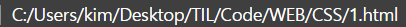
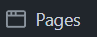
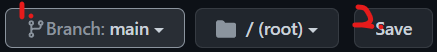
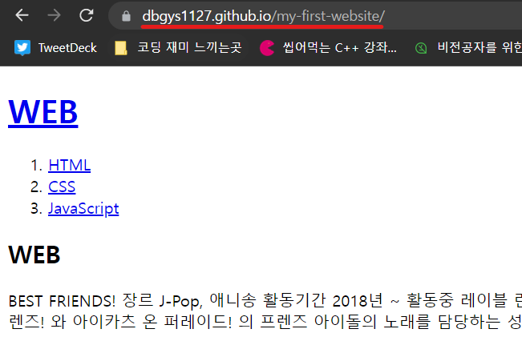
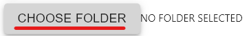
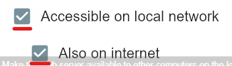
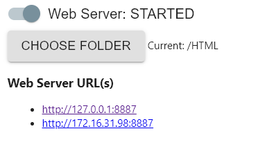

# 서버가 머야?
서버에 작성한 HTML을 연결하는 몇가지 방법을 공부하기 전에 서버란 무엇인지,  클라이언트는 무엇인지 짚고 넘어 가자. 
 

1. 예를 들어, a가 웹브라우저(네이버, 구글, 엣지 등)에서 '리버풀' 이란   
키워드로 검색을 하게 되면, 웹브라우저가 서버에 키워드와 관련된 정보를   
서버에 요청하게된다.
2. 요청을 받은 서버는 서버 컴퓨터에서 '리버풀'과 관련된 정보를 찾는다.  
3. 찾은 정보를 클라이언트(a)의 컴퓨터에 보내준다.
4. 웹브라우저는 서버에게 받은 정보를 고객에게 띄워준다.

- 이 과정을 통해, 서버란 어떤 정보를 담고 있고, 클라이언트는 정보를 요청한다    
는 것을 파악할 수 있다.
- 그렇다면, 내가 만든 html파일은 웹브라우저에서 띄워지니까 서버에 연동된걸까?
  - 아니다. 아래 그림에서 나타나듯, 그것은 단지 나의 로컬에 있는 자료를 띄운 것이다. 
 
- 서버에 연결한다는 것은 인터넷이 연결된, 다른 컴퓨터에서 자료 요청시,  
서버라는 컴퓨터에서 자료를 찾아 주기 때문에, 로컬 주소가 아닌 다른 주소가 나온다.

# 서버에 연동하기

## 1. 깃허브
1. 깃허브에 새저장소를 만든 후 서버에 올릴 파일을 푸쉬한다.
2. 저장소의 `settings` 버튼 클릭 

3. 좌측화면의 `pages`클릭 

4. 브랜치 `main` 선택 후 `save` 클릭 

5. 생성된 주소를 클릭해보면, 하단 주소창과 동일한 페이지가 열린다. 
 
 

## 2. Web server for Chrome
1. 크롬에서 Web server for Chrome를 설치한다.
2. 토글을 눌러 STOPPED상태로 만든다. 

3. choose 버튼을 눌러 올린 html폴더를 선택한다. 

4. Accessible on local network와 하위 목록을 체크한다. 

5. 다시 토글을 눌러 started로 바꾸면, 그림과 같이 서버에 내가 작성한    
HTML이 업로드 된다. 

## 3. apach
- 끝으로 아파치를 설치해서 설치된 장소에 `C:\Bitnami\wampstack-8.1.4-0\apache2\htdocs\`폴더에 HTML파일을 붙여놔도 서버에 등록된다.

## 4. etc
1. 댓글 기능 추가 및 관리 사이트([diqus](https://blog.disqus.com/))
2. 채팅 기능 추가 및 관리 사이트([tawk](https://www.tawk.to/))
3. 방문자수 분석 기능 추가 및 관리 사이트([Google analytics](https://analytics.google.com/analytics/web/#/))