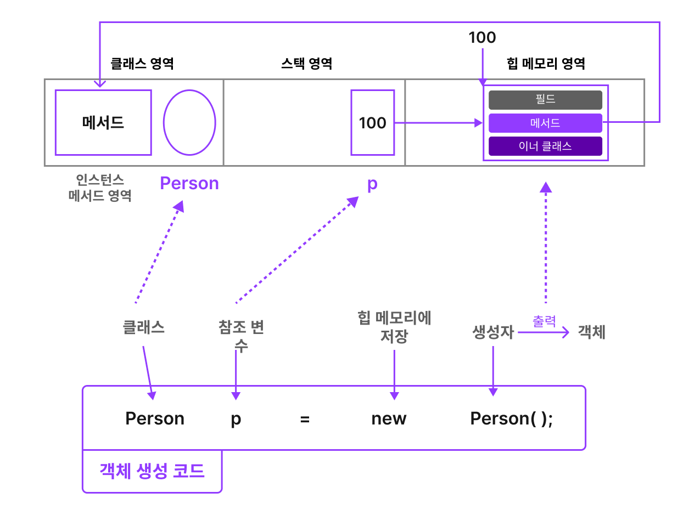

# 필드와 메서드


## 객체 생성시 메모리 구조
- 필드와 메서드 학습전에, 객체 생성 시에 메모리 구조를 살펴보자.
<br></img><br/>
    - 객체 생성코드를 쓰면, Person과 참조변수 p는 각각 클래스 영역과 스택영역에 저장된다. 
    - new 생성자로 만들어진 인스턴스는 힙 메모리에 저장되어 내부에 클래스 멤버들이 저장된다.
    - 이때, 참조 변수는 스택영역에 저장되며, 클래스 내부가 생성된 힙 메모리 주소를 가리키는 것을 볼수 있다.
    - 한가지 주목 해야 할것은 메서드의 기능을 구현한 코드는 클래스영역에 있다는 것이다.
    - `복잡하지만, 가장 기억해야 할 것은 클래스 저장공간과 객체생성 시 저장공간이 다르다는 점이다.`
## 필드
- 필드란 '클래스에 포함된 변수'를 의미하며, 객체의 속성을 정의할 때 사용한다.
- 필드는 클래스 변수와, 인스턴스 변수가 있으며, 이 둘은 static 키워드 유무로 분류된다.
```
클래스 변수 = static 존재
인스턴스 변수 = static 없음
```
## 자바의 변수
<br></img><br/>
- 자바의 변수는 클래스 변수, 인스턴스 변수, 지역변수 총 3가지가 있으며, 지역변수는 메서드 내에서 선언됨 변수다.
1. 인스턴스 변수
    - 인스턴스 변수는 객체 각각이 가지는 고유한 특성을 저장하는 용도로 사용한다.(나이, 이름, 성별 등)
    - new 생성자( )를 통해 인스턴스 생성시 만들어 진다.
    - 앞서 메모리 구조에서 보았듯이, `독립된 저장공간(힙메모리 영역)을` 가진다.
    - 이 점으로 인해 `같은 클래스에서 생성된 다양한 객체가 필드, 메서드 코드 재작성 없이 생성되는 것이다.`
2. 클래스 변수
    - static 키워드를 통해 생성된다.
    - 공통된 저장공간을 공유하는데, 메모리 구조에서 봤듯이, 클래스 영역을 의미하며, 클래스 영역은 클래스 코드 작성 시 배치 되는 공간으로, `클래스에 접근하는 명령어들이 필드와 메서드 메모리를 같이 쓰는 곳이다.`
    - 클래스로 생산된 모든 인스턴스가 특정값을 공유해야할 때 클래스 변수를 쓴다. (손가락/발가락 개수)
    - 클래스 변수는 인스턴스 생성없이 사용가능하다.
    ```
    클래스명.클래스_변수명(필드, 메서드)
    ```
3. 지역 변수
    - 메서드 내에 선언되며 메서드 안에서 쓸 수 있다.
    - 지역 변수는 `스택 메모리에 있다가, 메서드가 종료되면 사라진다.`
    - `힙메모리에 저장되는 필드변수는 객체가 지워지지 않으면 사라지지 않는다. 하지만, 지역변수는 사용되지않으면, 자동으로 사라진다.`
    - 지역변수는 직접 초기화하지 않으면, 오류가 발생한다.
    - 필드 변수는 힙메모리의 저장되므로 반드시 초기화가 필요하고, 초기화 누락을 방지하기위해 자동 초기화가 된다.   

## static 키워드
- static은 필드, 메서드, 이너클래스에 사용하며 static이 붙은 멤버를 정적멤버라 한다.

## static 변수(정적변수/정적필드/클래스 변수)
- 정적 변수와 인스턴스 변수에 가장 큰 차이는 객체를 생성해야 접근할 수 있는가 이다.
- 정적 변수는 객체 생성없이 접근 가능하지만, 인스턴스 변수는 그렇지 않다.
- 정적 필드는 객체간 공유 변수 성질이 있다.(정적메서드도) 그 이유는 클래스 영역에 있기 때문이다.
```java
public class StaticFieldTest {
    public static void main(String[] args) {
        StaticField staticField1 = new StaticField(); // 객체 생성
        StaticField staticField2 = new StaticField();

        staticField1.num1 = 100; //POINT - 인스턴스 변수
        staticField2.num1 = 1000;//POINT- 인스턴스 변수

        System.out.println(staticField1.num1);//POINT- 인스턴스 변수
        System.out.println(staticField2.num1);//POINT- 인스턴스 변수

        staticField1.num2 = 150;//POINT - 정적변수
        staticField2.num2 = 1500;//POINT - 정적변수
        System.out.println(staticField1.num2);//POINT - 정적변수
        System.out.println(staticField2.num2);//POINT - 정적변수

    }
}

class StaticField {
    int num1 = 10;
    static int num2 = 15;
}

//출력값
100
1000
1500
1500
```
- 위 코드에서, 인스턴스 코드는 객체 생성 후 각 객체에 100과 1000을 넣고, 출력했을때, 각각이 출력이 되었다.
- 정적 코드는 150, 1500을 입력하였는데, 1500으로 재할당되어서 출력되었다. 왜냐하면 `클래스에 접근하는 명령어들이 하나의 저장공간을 공유하고 있기 때문이다.`
- `정적 변수나, 정적 메서드는 인스턴스 변수나 인스턴스 메서드를 사용할 수 없다.`
- 왜냐하면, 정적 메서드, 변수는 인스턴스 없이 사용가능 한데, 이 말은 정적 메서드 선언시, 인스턴스가 생성되어 있지 않을 수도 있다는 것이다.

## 메서드
- 메서드는 특정 작업을 수행하는 명령문의 집합이며, 클래스의 기능에 해당하는 부분을 수행한다.
- 메서드의 구조는 다음과 같다.
``` java
접근지정자 반환타입 메서드명칭(매개변수타입 매개변수 명){//-> 메서드 시그니쳐(메서드를 구분하는 용도)
메서드 바디//->메서드의 실행 내용

}
```
- 이때 반환 타입이 void가 아니면 return이 반드시 있어야 하며, return 값은 반환타입과 일치해야한다.
- 메서드를 호출할때는 '.'포인트 연산자로 접근하며, 호출할때, 인자 타입, 인자 개수를 맞춰야 한다.

## 메서드 오버로딩
- 하나의 클래스 안에 같은 이름, 다른 기능을 하는 메서드를 여러개 만드는 것을 의미
- 오버로딩 성립조건
    - 같은 이름의 메서드명
    - 매개변수 개수나 타입이 달라야한다.(= 메서드 시그니쳐가 같아야한다.)
    - 반환타입은 관계 없음
    -> 오버로딩을 통해 다형성이 확보 될 수 있다.