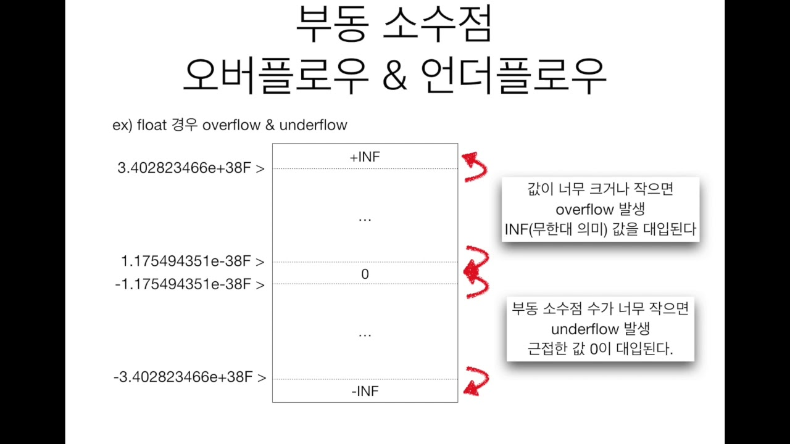

# 타입, 리터럴, 타입의 종류

## 타입

1. 타입이란?
    - 타입은 저장될 값의 유형 및 종류를 의미하며, `타입에 따라 값이 차지하는 메모리 크기`와 값이 `저장되는 방식이 결정`된다.

<br>

2. 기본 타입 vs 참조 타입
    - 기본타입(Primitive type) : 값을 저장할 때, 데이터의 실제 값이 저장됨
    ```
    int num = 7; // num에 7이 저장됨
    ```
    - 참조타입(Reference type) : 값을 저장할 때, 데이터가 저장된 곳을 나타내는 주소값이 저장된다. 기본 타입 외에 클래스, 객체배열, 배열 등이 해당된다.
    
<br>

3. 리터럴: 문자가 가리키는 값 그 자체 -> value(값)가 아니라 이제는 리터럴로 통일하자

## 타입의 종류
> 새로알게 된 내용만 추가 하겠다.

1. 정수 타입: byte(1byte), short(2byte), int(4byte), long(8byte)가 있다.
    - 오버플로우: 타입에 배정된 표현범위를 벗어나는 값을 입력시, 최소값으로 순환되는 것 ex) byte 형에서 127에서 1을 더할 시 128이 아니라 -128이 되는것
    - 언더 플로우: 타입에 배정된 표현범위를 벗어나는 값을 입력시, 최대값으로 순환되는 것 ex) byte 형에서 -128에서 1을 뺄 시 -129이 아니라 127이 되는것
    
    - 정수형의 오버/언더는 원 형태를 기억하자!

<br>

2. 실수 타입: float(4byte), double(8byte)
    - float는 리터럴 입력후 f를 붙혀줘야 한다. -> `float num = 0.01f;`
    - 실수는 오차가 있는데 정밀도는 double이 더 높다.
    - 오버플로우: 양이나 음의 최대 표현 범위를 넘어가면 무한대가 된다.
    - 언더플로우: 양이나 음의 최소 표현 범위를 넘어가면 0이 된다.
    
    - 양이든 음이든 절대값으로 변환 후 최대값을 벗어나면 무한, 최소값을 벗어난 0으로 기억하자.

3. 문자형: char(2byte)
    - 자바는 유니코드(각문자에 숫자코드번호 부여) 숫자값으로 저장됨
    - 따라서, 숫자를 문자형 변수에 할당할 수 있다.
    - 문자 -> 숫자 로 변환 되서 저장, 숫자->문자로 변환 가능
    - char을 int로 변환할때, char 변수의 값을 유니코드의 숫자로 바꾸기 때문에, 예를 들어 '9'를 변환 하면 int 9가 아니라 유니코드값이 나온다. 이때, 9를 얻고 싶다면, `int a = Character.getNumericValue()`메서드를 써야함
    - int를 char로 변환할때도, 위에 이유로 인해 `char c=Character.forDigit(a,REDIX)` 메서드를 써야한다. 이때 a는 int, REDIX는 변환 진수이다.

## 타입 변환
>boolean 타입을 제외한 다른 타입은 서로 변환이 가능하다.

1. 자동변환 원칙
    - 크기가 작은것에서 큰타입으로 변환시
    - 덜 정밀한 것에서 더 정밀한것으로 변환시-> `byte->short/char->int->long->float->double`

2. 수동변환 원칙(캐스팅)
    - 자동 타입이 안되는 경우