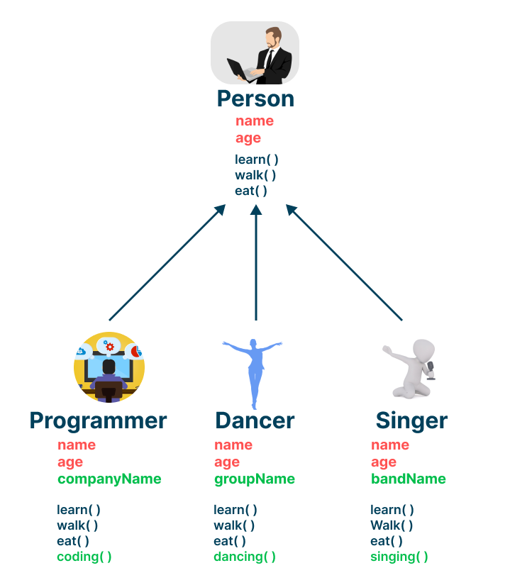
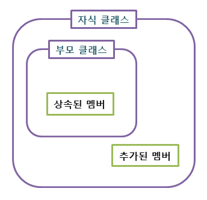

# 상속
- 상속은 `기존 클래스를 재사용해서 새로운 클래스를 만드는 것`이다.

 </img> 
- 상속을 받게 되면 그림 통해 볼수 있듯이, `상위 클래스 멤버를 하위클래스가 모두 공유`하게 된다.
- 하위 클래스는 상위 클래스가 가진 모든 멤버를 갖게 되나 반대는 그렇지 않다.
- 따라서 `하위클래스의 멤버는 상위 클래스 멤버보다 같거나 많다`.

 
</img>
 

## 상속 장점
- 코드를 `재사용하여 보다 적은양의 코드로 새로운 클래스를 작성할 수 있어 코드 중복이 준다`.
- 부모클래스의 멤버를 재선언하지 않아도 되서 코드 중복이 준다.
- 다형적 표현이 가능하다. -> 오버라이딩을 받으면, 같은 메서드를 다르게 쓸 수 있다.

## 특이점
- 자바의 상속은 단일상속이다.->하나의 하위클래스는 하나의 상위 클래스만 가질 수 있다.
- `인터페이스는 다중 상속이 가능하여 병행하면, 단일상속의 단점을 보완`할 수 있다.