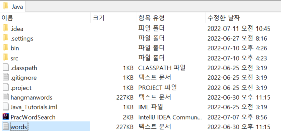

# 명품자바 ch8 실습문제 (11번~14번까지 기록할만한 것)

## 11번 문제
> 1. 11번 문제는 사용자의 입력이 `완벽한 단어가 아니라도, 사용자의 입력이 포함된 모든 단어를 출력해주는 사전을 만드는 문제다.` `사전역할을 하는 원본파일이 있으며, 그것과 입력스트림을 연결해야하는 것이 중요하다.`
> 2. 입력받은 단어 한줄한줄을 다 저장할 곳이 필요한데, 여기서는 `Vector<String>` 객체에 저장하자.
> 3. Vector 객체가 소스에서 단어를 저장하는 사전 역할을 한다면, `사용자 입력 문자열이 포함되어 있는지 확인하는 절차가 필요하다.`

<br>

```java
import java.util.*;
import java.io.*;
//1. BufferedReader 생성자를 이용해, word.txt와 연결한다.
//2. Scanner를 BufferedReader와 연결한다.
//3. Vector 객체를 생성한다.
//4. Scanner 객체의 hasNext()메서드가 false를 뱉어낼때까지
//5. Scanner를  nextLine으로 한라인씩 읽어서 Vector에 add한다.
//6. 검색할 단어를 String으로 저장한다.
//7. 저장된 단어를 while문을 만들어 contains 메서드로 참 거짓을 가리고,

public class PracWordSearch {
    public static void main(String[] args) {

       Vector<String> v = new Vector<>();//->POINT1
       try {
           Scanner scanSrc = new Scanner(new FileInputStream("words.txt"));//->POINT2
           while(scanSrc.hasNext()){//->POINT3
               v.add(scanSrc.nextLine());//->POINT3
           }
           scanSrc.close();
           System.out.println("단어사전을 만들었습니다. 검색해보세요!");
           Scanner userScan = new Scanner(System.in);//->POINT4
           while(true){
               boolean found =false;//->POINT9
               System.out.print("단어 >> ");
               String userInput = userScan.next();//->POINT5
               if(userInput.equals("그만")){
                   System.out.println("사전을 종료합니다.");
                   break;
               }
               for(int i=0;i<v.size();i++){//->POINT6
                   String word = v.get(i);//->POINT6
                   if(word.length()<userInput.length()) continue;//->POINT6
                   String frontWord = word.substring(0,userInput.length());//->POINT7
                   if(frontWord.equals(userInput)){//->POINT8
                       System.out.println(word);//->POINT8
                       found =true;
                   }
               }
               if(!found) System.out.println("찾을 수 없습니다.");//->POINT9
           }
           userScan.close();
       }catch (IOException e){

           System.out.println("연결실패");
           e.printStackTrace();
       }
    }
}
```
### POINT
1. 사전 소스에 단어를 저장하기 위해 `Vector`객체가 필요하다.
2. Scanner `객체 생성자에 인자`로 입력스트림을 전달할 수 있다.
3. 
    - Scanner 객체 생성자 인자로 `System.in` 넣었을때, 객체명.next() 할시, 입력값을 받아 오듯이, 
    - 입력스트림을 인자로 받아서, 객체명.nextLine() 메서드를 쓰면, `띄어쓰기 단위로 값을 받아온다. `
    - `hasNext()는 받아올 것이 없을때, false를 뱉는다.`
    - `Vector객체.add(Scanner객체.nextLine())`하면, 소스의 띄어쓰기 전까지 단어가 Vector 요소로 저장된다.
4. 사용자의 검색을 받기 위해, Scanner 객체를 하나 더 생성한다.
5. 사용자의 검색을 받기 위해, Scanner 객체를 하나 더 생성한다.
6. - 사전에 저장된 모든 단어를 검색하기 위해, for문 조건을 `Vector객체.size()`를 쓴다.
    - `Vector객체.get(i)`를 통해 `Vector 내 첫번째 index 부터 끝까지 한번씩 꺼내 온다.`
    - 꺼낸 단어가 사용자가 입력한 값보다 길이가 짧으면, 사용자가 입력한 것과 다르기 때문에, 사용자의 입력값의 길이와 비교한다.
7. `String객체.substring(짜를 인덱스,짜를 길이)`를 통해, `Vector에 있는 단어를 유저가 입력한 값의 길이 만큼 짤라서`, 새로운 String에 저장한다.
8. 유저가 입력한 값과, `Vector에서 짜른 단어가` 같다면, 짜르기전 단어를 출력한다.
9. boolean 객체는 하나도 못찾을때, 찾지 못했다는 안내용으로 사용한다.

<br>

## 12번 문제
> 1. 11번 문제와 동일하지만, 사용자의 입력값이 포함 되기만 하면된다.
> 2. 다시말해, 11번문제는, `ous` 입력시 단어사전에서 `ous`로 시작하는 단어만 검색되기 때문에, `house`는 검색되지 않는다. 하지만, 이 문제는 포함만 되면 되어서, `house`도 검색된다. 
> 3. 또한, 앞서 미리 연결된 파일이 있는 것과 달리 이 문제는, `사용자의 입력을 받아 연결 파일을 받는 다는 점이 중요`하다.

<br>

```java
import java.io.*;
import java.util.*;

public class PracWordSearchFile {

    private String userInput;
    private String word;
    private Scanner srcScan;
    private Scanner userScan=new Scanner(System.in);
    private Vector<String> v =new Vector<>();

    public boolean LinkFile(){
        try{
            System.out.print("대상 파일명 입력>> ");
            userInput = userScan.next();
            srcScan = new Scanner(new FileInputStream(userInput));//-POINT1
            while(srcScan.hasNext()){
                v.add(srcScan.nextLine());
            }
            srcScan.close();
            return true;
        }catch(IOException e){
            System.out.println("연결실패");
            return false;
        }
    }
    public void findWord(){
        while(true){
            boolean found = false;
            System.out.print("검색할 단어나 문장>> ");
            userInput = userScan.next();
            if(userInput.equals("그만")){
                System.out.println("종료합니다.");
                break;
            }
            for(int i=0;i<v.size();i++){
                word=v.get(i);
                if(word.contains(userInput)){//-POINT2
                    System.out.println(i+1+": "+word);
                    found=true;
                }
            }
            if(!found){
                System.out.println("찾을 수 없습니다.");
            }
        }
        userScan.close();
    }

    public void run(){
        System.out.println("전체 경로명이 아닌 파일 이름만 입력할 경우, 파일은 프로젝트 폴더에 있어야 합니다.");
        if(LinkFile()) findWord();
    }

    public static void main(String[] args) {
        PracWordSearchFile Game = new PracWordSearchFile();
        Game.run();
    }
}
```
### POINT
1. - Scanner 객체 생성자에 입력 스트림을 연결하는데, 이때, 입력 스트림에 생성자 인자로, 사용자가 입력한값을 String으로 받아서, 연결한다. 
    - 이때, 검색되는 파일은 전체 경로를 적지 않을 경우 반드시, `src 디렉터리의 상위 디렉토리에 있어야한다.`
    
    - 또한, 파일 연결 실패가 있을 수 있으므로, 예외처리를 해야한다.
2. `String 객체.contains(문자열)` 메서드를 사용할때, 인자로, 검색할 문자열을 전달하면, 문자열이 있을 시 true, 없을 시 false를 뱉는다.

<br>

## 13번 14번 문제
> 1. 13번 문제는 파일 탐색기를 만드는 문제이다.
> 2. 기능은 아래와 같다.
> 3. `..`입력 시 상위 디렉토리로 이동 후 디렉토리 내 파일, 폴더 출력   
> 4.  `디렉토리 명` 입력 시 해당 디렉토리로 이동 후 디렉토리 내 파일, 폴더 출력
> 5.  `mkdir 폴더명` 입력 시 `폴더명`인 폴더 생성
> 6. `rename 1st파일/폴더명 2nd파일/폴더명` 입력 시 `1st가 2nd로 이름이 변경됨`
> 7. 이 문제에 포인트는 다음과 같다.
> 8. 현 디렉토리에 요소를 어떻게 출력 할 것인가?
> 9. 현 디렉토리에서, 상위 디렉토리, 유저가 입력한 디렉토리로 가기위해, File 객체를 디렉토리와 연결해야하는 데 그때, File 생성자에 디렉토리를 문자열로 어떻게 전달할 것인가?
> 10. 현 디렉토리에 새로운 폴더를 만들때, File 생성자에 디렉토리를 문자열로 어떻게 전달할 것인가?
> 11. 현 디렉토리에 파일/폴더 이름을 바꿀 껀데, 대상 파일/폴더를 어떻게 File 객체와 연결, 바꿀이름을 File 객체에 전달 하는 방법

<br>

```java
import java.io.File;
import java.util.Scanner;

//1. 루트폴더를 c:\로 한다.
//2. File 객체를 c:와 연결한다.
//3. File [] listFiles()로 리스트를 저장한다.
//4. dir인지 file인지 / 파일 크기 / 파일이나, 디렉토리 명
//5. 이동할 디렉토리 입력 받기
//6. 입력받은 디렉토리 listFiles 객체에 재연결하기
public class PracMoveDir {
    private String maindir = "C:\\"; //->POINT1
    private File mainDir = new File(maindir);//->POINT1
    private Scanner Scan = new Scanner(System.in);
    File [] storeDir;//->POINT1
    String userInput;

    PracMoveDir(){
        System.out.println("***** 파일 탐색기입니다. *****");
        storeDir=mainDir.listFiles();//->POINT1
        System.out.println("["+mainDir.getPath()+"]");
        String type = "dir";
        String name = null;
        long size =0;
        for(int i=0;i<storeDir.length;i++){//->POINT2
            if(storeDir[i].isFile()){//->POINT3
                type = "file";
            }
            size = storeDir[i].length();//->POINT4
            name = storeDir[i].getName();//->POINT5
            System.out.println(type+" \t"+size+"바이트\t"+name);
        }
    }

    public  void run(){
        while(true) {
            System.out.print(">> ");
            String userInput = Scan.nextLine();//->POINT6
            String[] renameBox = userInput.split(" ");//->POINT10

            if (userInput.equals("그만")) {
                System.out.println("종료합니다.");
                break;
            }

            switch (renameBox[0]) {
                case ".."://->POINT7
                    maindir = maindir.replaceAll(mainDir.getName(), "");
                    break;
                case "rename"://->POINT9
                    File f = new File(mainDir.getPath() + "\\" + renameBox[1]);//->POINT10
                    try {
                        f.renameTo(new File(mainDir.getPath() + "\\" + renameBox[2]));//->POINT11
                        break;
                    }catch (ArrayIndexOutOfBoundsException e){
                        System.out.println("바뀔대상과 바뀔이름을 정확히 입력하세요.");//->POINT12
                    }
                case "mkdir":
                    File mkf = new File(mainDir.getPath() + "\\" + renameBox[1]);//->POINT13
                    if (!mkf.exists()) {//->POINT14
                        mkf.mkdir();//->POINT14
                    }
                    break;
                default:
                    maindir += userInput + "\\";//->POINT8
            }
            mainDir = new File(maindir);
            try{
                storeDir = mainDir.listFiles();
                System.out.println("[" + mainDir.getPath() + "]");
                String type = null;
                String name = null;
                long size = 0;
                for (int i = 0; i < storeDir.length; i++) {
                    if (storeDir[i].isDirectory()) {
                        type = "dir";
                    } else {
                        type = "file";
                    }
                    size = storeDir[i].length();
                    name = storeDir[i].getName();
                    System.out.println(type + " \t" + size + "바이트\t" + name);
                 }
             }catch (NullPointerException e){
                System.out.println("검색어를 다시 입력하시오.");
            }//->POINT15
        }
    }
    public static void main(String[] args) {
        PracMoveDir Game = new PracMoveDir();
        Game.run();
    }
}
```
### POINT
1. - 프로그램 시작시, `C:`디렉토리 내 요소들이 전부 출력되어 하기 때문에, `String 객체에 C:` 디렉토리 경로를 `maindir` 문자열로 초기화 시킨다.
    - maindir을 File 객체(mainDir) 생성자에 연결한다.
    - `File [] storeDir`을 통해, mainDir 내 폴더/디렉토리 각 요소를 저장할 공간을 마련한다.
    - `mainDir.listFiles()` 메서드로 mainDir 내 폴더/디렉토리를 모두 저장한다.
2. mainDir 내 요소들 각각은 `storDir 객체 배열에 저장되어있다.` 따라서, 요소를 모두 출력하기 위해서는, 반복문에 조건으로 `storDir 객체 배열의 크기`만큼 반복 하면된다.
3. `storeDir[i].isFile()`메서드는 참일경우 파일 거짓일 경우 dir를 의미한다.
4. 파일/폴더의 `크기를 알기 위한 메서드는 length()`이다.
5. 파일/폴더의 `이름을 알기 위한 메서드는 getName()`이다.
6. userInput에는 사용자의 명령어를 입력받는다.
7. renameBox 문자열 배열에서 `renameBox[0]은 userInput에 문자열을 기능으로 구현하기 위한 기준으로 쓴다.` 특히, `"공백"을 기준으로 userInput문자열을 쪼게는 것은 mkdir과 rename 명령은 공백 뒤에 파일/폴더명이 따라 오기때문에, 나눠줘야한다.`
8. mainDir문자열은 switch 문내에서 새롭게 작성되어 재할당 된다.
9. - 사용자가 입력한 디렉토리로 이동하기 위해서는 C:\\현 디렉토리 \\ `user입력명\\`의 형태 다시 말해, `user입력명 + \\`의 문자열이 기존 문자열 뒤에 더해져야한다.
    - 따라서 `maindir += userInput + "\\";` 코드가 그것을 가능하게 한다. 
    - 여기서, default로 user가 입력한 곳으로 이동 명령을 수행하는 이유는, renameBox[0]으로 구별하기에 경우에 수가 많기 때문이다.
10. - `..` 명령시 필요한 문자열은 C:\\`현 디렉토리`에서 `현 디렉토리`만 자르면 된다.
    - 구현을 위해서, `maindir.replaceAll(바꿈당할문자,바꿀문자)`메서드를 쓴다. 
    - 이때, 바꿈당할문자는 현재 디렉토리이기 때문에, `File객체.getName()메서드를 쓰면, 현 디렉토리 문자열을 얻을 수 있다.`
11. renameBox[0]이 rename일때, 파일/폴더의 이름을 바꾼다. 이때, File 객체가 하나 더 필요하고, 바꿀 폴더/파일을 찾기 위해서는 새로운 객체 생성자에 다음과 같은 문자열이 필요하다. `현재까지 전체 경로 + 사용자가 입력한 파일/폴더명`
12. - 현재까지 전체 경로를 가져오기 위해 `mainDir.getPath()`메서드를 쓰면, 전체 경로가 문자열로 리턴된다.
    - 이 문자열에 유저가 쓴 경로가 담긴 renameBox[1]을 +해주면 된다. `+\\+renameBox[1]`
13. - 바꿀 이름은 `현재까지 전체 경로 + 사용자가 입력한 파일/폴더명`문자열이 필요하다.
    - 현재까지 전체 경로를 가져오기 위해 `mainDir.getPath()`메서드를 쓰면, 전체 경로가 문자열로 리턴된다.
    - 이 문자열에 유저가 바꿀 이름이 담긴 renameBox[2]을 +해주면 된다. `+\\+renameBox[2]`
    
14. 명령어에 필요한 문자열이 부족하면, 예외처리를 할 수 있게 해준다.
15. - mkdir에 필요한 문자열은 `현재까지 전체경로 + 생성할 폴더 이름`이다. 
    - 현재까지 전체 경로를 가져오기 위해 `mainDir.getPath()`메서드를 쓰면, 전체 경로가 문자열로 리턴된다.
    - 이 문자열에 유저가 만들 이름이 담긴 renameBox[1]을 +해주면 된다. `+\\+renameBox[1]`
16. `File 객체.exists()`메서드는 입력한 이름이 중복으로 존재하는지를 판단해준다. 없으면, `File 객체.mkdir()`메서드를 쓰면, File 객체에 연결된 폴더가 생성된다.
17. 생성자에서 했던, 디렉토리 요소를 출력하는 반복문이다.
18. 폴더 이동시 찾는 폴더가 없을때, 예외처리이다.

<br>
