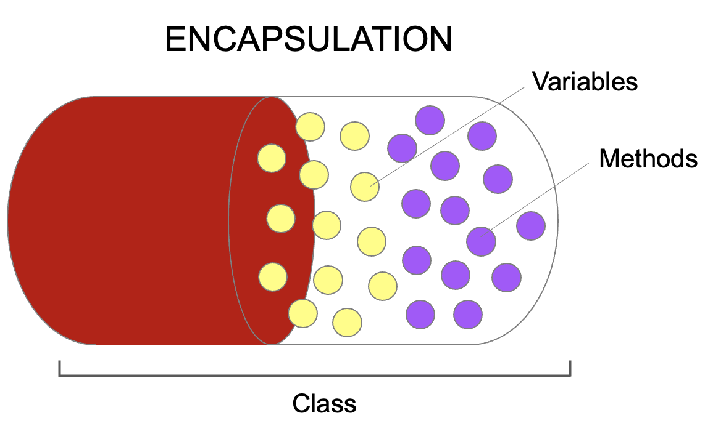
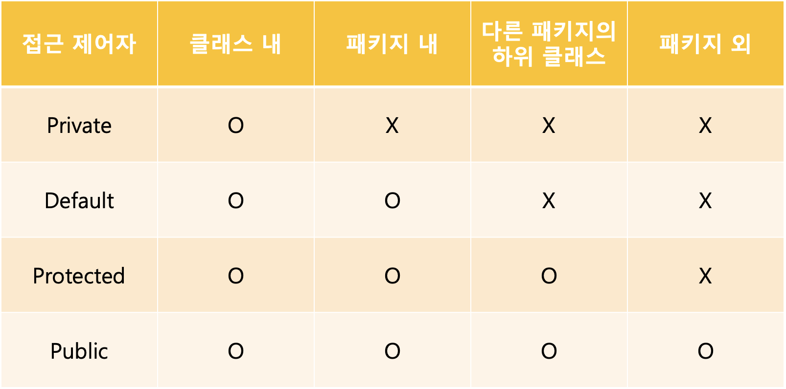

# 캡슐화
</img>
- 특정 객체 안에 데이터(필드와 데이터 : 속성, 기능)를 하나의 캡슐로 만들어 데이터를 보호하는 것
## 목적
1. 데이터 보호
2. 내부적으로 쓰는 데이터의 불필요한 `외부유출방지`
3. 외부로부터 객체 속성과 기능 변경 방지
4. 유지보수와 확장시 오류 범위 최소화

## 패키지 
- `특정한 목적을 공유`하는 `같은 기 능`을 하는 클래스와 인터페이스의 묶음
- 패키지는 물리적인 하나의 디렉토리이고, 하나의 패키지에 속한 클래스나 인터페이스 파일은 모두 해당패키지에 속해있다.
- 계층구조가 있다면, `.`로 구분한다.
- 패키지는 첫줄에 쓴다.
- `패키지로 묶으면 같은 이름의 클래스끼리 충돌을 막아준다.`

## import
- 다른 패키지 내의 클래스를 사용하기 위해 사용
- 패키지 문과 클래스문 사이에 씀
- `import 패키지명.클래스명;`

## 접근 제어자
- 제어자는 접근제어자(public, protected, default, private), 기타 제어자(static, final, abstract)로 구분됨
- 제어자는 `빨간 사과` 할때 `빨간`과 같은 형용사 처럼 쓰이며, 하나의 대상에 여러제어자를 사용할 수 있다.
- 하지만, 접근제어자는 한번만 쓸 수 있다.
- 접근 제어자를 쓰면 클래스 외부의 불필요한 데이터 노출 방지를 할 수 있다.
</img>
- public : 접근 제한 없음
- protected : 동일패키지에 있거나, 다른 패키지의 하위 클래스에서 접근 가능
(이해를 돕기위해 아래 코드를 보자)
```java
package package2; // package2 

//파일명 Test2.java
import package1.Parent;

class Child extends package1.Parent {  // package1으로부터 Parent 클래스를 상속
    public void printEach() {
        // System.out.println(a); // 에러 발생!
        // System.out.println(b);
        System.out.println(c); // 다른 패키지의 하위 클래스
        System.out.println(d);
    }
}

public class Test2 {
    public static void main(String[] args) {
        Parent p = new Parent();

//        System.out.println(p.a); // public을 제외한 모든 호출 에러!
//        System.out.println(p.b);
//        System.out.println(p.c);
        System.out.println(p.d);
    }
}
```
- 코드 분석
    -  먼저 위 코드에 패키지는 `package2 이며, Child 클래스는 package2에 있지만, import문을 통해, Parent 클래스를 상속 받았다`. -> 이 말이 `다른 패키지의 하위 클래스 조건을 만족 시킨다.`
    따라서, 에러가 나지 않는다.
    - 하지만, `Test2는 package2에 속해있으며, Parent와는 아무 관계가 없다.` 따라서 에러가 난다.
- default : 동일 패키지에 있을때만 접근가능하다.
- private : 동일 클래스에 있을때만 접근가능하다.