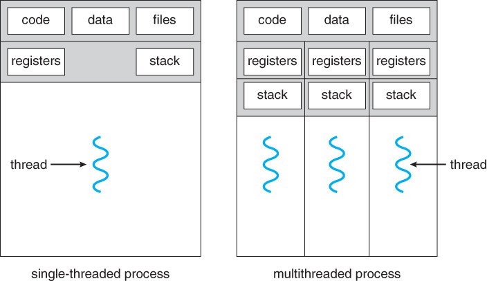

# 자바의 멀티스레딩
## 멀티태스킹
### 멀티태스킹이란?
 </img> 
- 멀티태스킹은 일상에서도 자주 이루어지는 것들이다.
- 컴퓨터 기술 용어로서 멀티태스킹은 여러 프로그램 코드(작업, 테스크가) 동시에 실행되는 것을 말한다.
- 간단한 프로그램은 단일 작업만 하지만, 대부분 프로그램은 여러 작업을 동시에 실행한다.

## 스레드와 멀티테스크
 </img> 

### 스레드란?
- 스레드란 직역하면 `실`이다. 스레드는 실의 특성과 닮아 있다. 
- 컴퓨터에서 스레드는 프로그램코드를 실행하는 `하나의 실 혹은 제어의 개념`이다.
- 하나의 실로 하나의 바느질밖에 할 수 없듯이, `하나의 스레드로 하나의 작업 밖에 처리할 수 없다.`
- `좌측 그림`은 한 응용프로그램에서 3개의 작업이 동시에 실행되고 있는 모습이다.
    - 이때, 3개의 스레드는 상호 독립적이다.
    - 스레드로 인해, code, data, files 프로그램이 동시에 실행될 수 있다.
- 스레드는 운영체제나 JVM에서 작업을 실행하는 단위로서, `운영체제나, JVM에 의해 관리되는 단위이다.`

## 멀티프로세싱과 멀티스레딩
 </img> 

### 멀티프로세싱
- 하나의 응용프로그램을 `여러 개의 프로세스로 구성하여 각 프로세스가 하나의 작업을 처리하도록 하는 기법`
- 각 프로세스는 고유한 메모리 영역을 보유하고 독립적으로 실행된다.
    - 고유한 메모리 영역을 보유 하기 때문에, 한 응용프로그램안에 프로세스들은 서로 변수를 공유할 수 없다.
    - 공유하기 위해서는 통신해야하는데, 해도 과도한 작업량과 시간소모가 문제다

### 멀티스레딩
- 하나의 응용프로그램을 여러 스레드를 통해 동시에 작업한다는 점은 멀티프로세싱과 같다.
- 하지만, `자원과 메모리를 공유`하기에 시간 소모나, 오버헤드가 적다.

### 멀티스레딩은 언제 활용하면 좋을까?
- 웹 서버 소프트웨어에서 활용도가 아주 높다.
- 예를 들어 동시에 1000명의 클라이언트가 영상을 요청할때, 싱글스레드라면, 요청->전송을 1000번을 해야하고, 1000번째 받는 고객이 화가 많이 날것이다.
- 하지만, 각 클라이언트에 대응하는 스레드가 있다면, 이론상 1번 요청->전송을 하면 모든 클라이언트에게 정보를 줄수있다.

## 자바의 멀티스레딩
### 멀티스레드와 JVM
- 자바는 프로세스가 존재하지 않고 스레드 개념만 존재하며, JVM은 멀티 스레딩만 지원한다.
- 자바 스레드는 JVM에 의해 스케쥴되는 `실행 단위 코드`이다.
- 응용프로그램이 n개가 실행된다면, n개의 JVM이 실행된다.
- 이때 각 응용프로그램은 독립적인 메모리 영역에서 실행된다.
- 또한, 응용프로그램이 종료되면 JVM도 종료된다. 반대로 응용프로그램이 시작되면 JVM도 실행된다.
- 응용프로그램간 통신을 하려면 소켓 동신과 같은 방법을 써야 한다.

### 자바 스레드와 자바 가상기계
- 스레드를 만들기 위해서 `개발자는 스레드로 작업할 코드를 작성하고`, 코드를 `JVM에 스레드로 등록하는 절차와 실행하도록 JVM에 요청만 하면된다.`
- 그 후 부터 스레드 코드 실행, 중단과 같은 것 `스레드 스케줄링`이라 부르는 작업은 JVM이 수행한다.
- 또한, 스레드 관련 정보 역시 JVM이 관리한다.