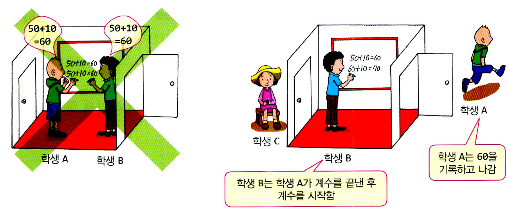
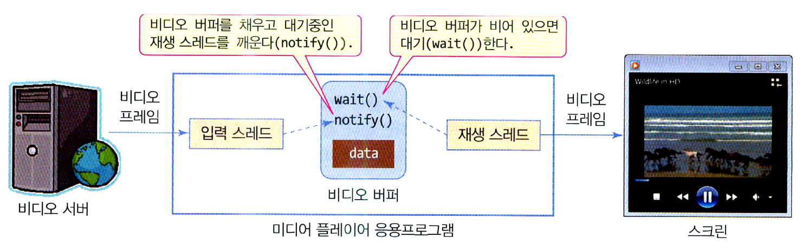

# 스레드 동기화
## 스레드 동기화의 필요성
<br></img><br/>
- 다수의 스레드가 `공유 자원 혹은 공유 데이터에 동시에 접근`할 때 예상치 못한 결과를 낳을 수 있다.
- 위 사례의  
    - 왼쪽을 보면, 칠판(공유자원)에 학생 둘이 동시에 들어가서 각자 것을 적다보니, 원래 20이 합산되어야 하는데, 10만 더해진 결과가 된다.
    - 우측을 보면, 한명씩 들어가서 쓰기 때문에, 값이 정상적으로 나온다.
- 위 사례에서 우측이 다수의 스레드가 공유자원에 접근해서 발생하는 문제를 해결해주는 `스레드 동기화`이다.
- 스레드 동기화는 두가지 방법이 있다.
    - synchronized로 동기화 블록 지정
    - wait()-notify() 메소드로 스레드 실행 순서 제어

## synchronized 키워드
- 스레드 동기화 기법 중 가장 일반적인 것은 하나씩 순차적으로 공유 데이터에 접근하게 하는 것이다.
- 먼저 온 스레드가 공유 데이터에 작업할 동안 타 스레드의 접근을 잠그면, 동기화가 된다.
- synchronized 키워드는 임의의 코드 블록을 동기화가 설정된 `임계 영역`으로 지정한다.
- 임계 영역이 `잠겨 있으면, 그 앞에서 타 스레드는 대기`를 하게 된다.
- 락은 스레드가 작업을 마치면 풀린다.

### 메소드 전체를 임계 영역으로 지정
```java
synchronized void add(){
    int n = getCurrentSum();
    n += 10;
    setCurrentSum(n);
}
```
- add() 메소드가 호출되면 자동으로 동기화된다. 한 스레드가 add() 메소드를 호출하여 실행하고 있는 도중에 다른 스레드가 add() 메소드를 호출하면, 뒤에 온 스레드는 첫 번째 스레드가 add()를 마치고 나올때 까지 대기한다.

### 코드 블록을 임계 영역으로 지정
```java
void execute(){
    ........
    synchronized(this){
        int n = getCurrentSum();
        n += 10;
        setCurrentSum(n);
    }
}
```
- 위와 같이 원하는 위치를 `{}`를 이용하여 임계영역을 지정할 수 있다.
- 여기서 this는 execute를 실행시킨 스레드 객체다.

## wait(), notify(), notifyAll()을 이용한 스레드 동기화
### wait() - notify()를 이용한 스레드 동기화가 필요한 경우
<br></img><br/>
- 공유 메모리를 통해 `두 스레드가 데이터를 주고 받을때`, 공유 메모리에 대해 `두 스레드가 동시에 접근하는 producer - consumer 경우 필요하다.`
- 위 그림을 순차적으로 쪼게서 이해해보자.
    1. 비디오 스트리밍 소프트웨어는 네트워크 서버로부터 압축된 비디오 프레임을 