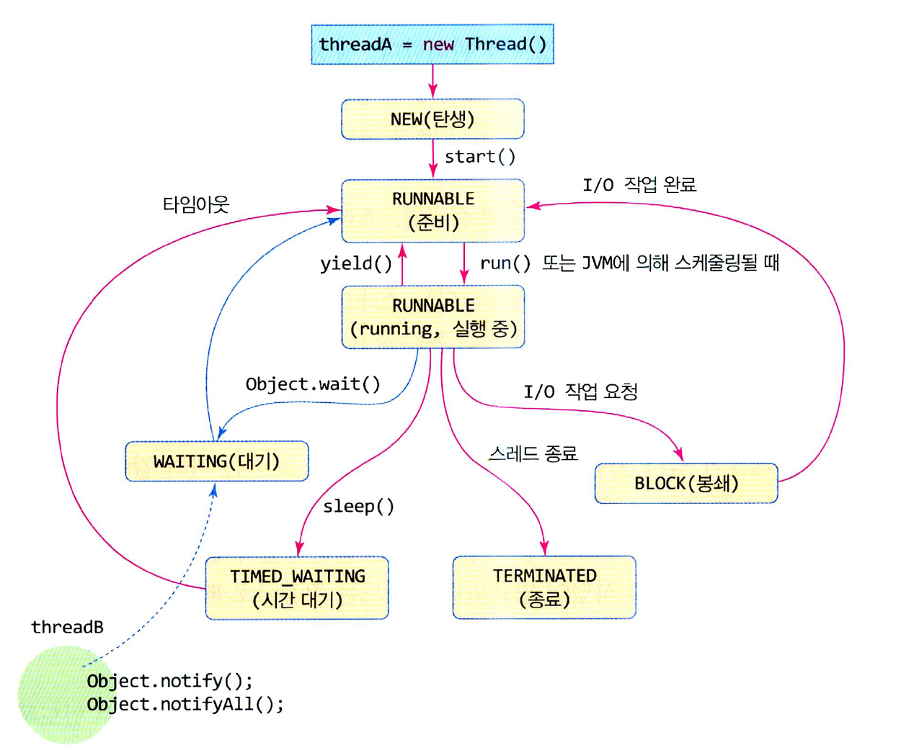

# 스레드 상태와 스케줄링

## 스레드 상태
 </img> 
- 스레드는 JVM에게는 생명체와 같다. 스레드는 태어나고, 실행하고, 잠자고, 대기하고, 종료하는 `생명주기를 갖고 있다.`
- 스레드의 상태는 총 6가지이며, 위 사진과 화살표를 유념해서 보자.
    - NEW : 스레드가 생성되었지만 아직 실행할 준비가 되지 않은 상태이다. start()   메서드가 호출되면 RUNNABLE 상태가 된다.
    - RUNNABLE : 스레드가 현재 실행되고 있거나, 실행 준비가 되어, 스케줄링을 기다리는 상태이다. 
    - TIMED_WAITING : 스레드가 sleep(n)를 호출하여 잠을 자는 상태이다. n밀리초 동안 잠을 자고, 시간이 지나면 다시 RUNNABLE이 된다. 
    - BLOCK : 스레드가 I/O 작업을 실행하여 I/O 작업이 완료될 때까지 멈춘 상태이다.
     이때, 작업을 진행 중일때는 `JVM이 현재 스레드를 BLOCK상태로 두고, 다른 스레드를 스케줄링 한다.`
    - WAITING : 스레드가 동기화 객체 a에 대해 a.wait()을 호출하여, 다른 스레드가 a.notify(), a.notifyAll()을 불러줄 때까지 무한정 기다리는 상태이다. 
    - TERMINATED : 스레드가 종료한 상태이다. 더이상 다른 상태로 변이할 수 없다.