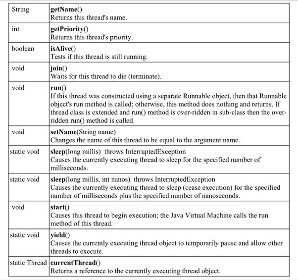

# 스레드 만들기와 사용

## 스레드 만들기
- 스레드를 만들기 위해 개발자는 두 가지만 하면된다.
    1. `스레드 코드 작성`(스레드가 할일)
    2. JVM에게 스레드를 생성하고 `스레드 코드를 실행하도록 요청`
- 스레드 코드를 작성하는 방법은 두 가지가 있다.
    1. Thread 클래스 이용
    2. Runnable 인터페이스 사용

### Thread 클래스
- Thread 클래스의 경로명은 `java.lang.Thread`이다.
- Thread 클래스를 상속받아 개발자는 스레드 코드를 만들 수 있다.
- Thread 클래스의 메소드는 다음과 같다.
<br></img><br/>

### Thread 클래스 상속받아 스레드 만들기
1. 스레드 클래스 작성: Thread 클래스 상속
- 먼저 Thread 클래스를 상속받은 클래스를 만들어야 한다.
```java
class SonThread extends Thread{/// Thread 클래스 상속 받음
    ...
}
```
2. 스레드 코드 작성: run() 메소드 오버라이딩
- `run() 메소드에 작성된 코드`를 `스레드 코드`라고 부른다.
- 스레드는 `run()에서부터 실행을 시작하고 run()이 종료하면 스레드도 종료`된다.
```java
class SonThread extends Thread{/// Thread 클래스 상속 받음
    @Override
    public void run(){// Thread class의 run()오버라이딩
        //실행하고자 하는 코드
    }
}
```
- `만일 run()을 오버라이딩하지 않으면 스레드가 바로 종료된다. `

3. 스레드 객체 생성
```java
SonThread th = new SonThread(); //스레드 객체 생성
```
- 객체를 생성했다고, `스레드가 작동하는 것은 아니다.` 
- 스레드는 JVM에 `등록`되어 JVM에 의해 `스케줄링` 되어야 작동한다.

4. 스레드 시작 : start() 메소드 호출
- 스레드 생성에서 제일 중요한 마지막 과정은 스레드가 실행을 시작할 수 있게, JVM에 `등록하는 것`이다.
```java
th.start();
```
- start()메소드는 Thread 클래스에 구현되어 있으므로, 오버라이딩하면 안된다.
- start()메소드는 생성된 스레드 객체를 JVM이 스케줄링 가능한 상태로 만든는 메서드이다.
- 이후 JVM에 의해 run() 메소드가 호출 된다.

### Runnable 인터페이스
- Runnable 인터페이스의 경로명은 `java.lang.Runnable`이다.
- Runnable 인터페이스는 run() 추상메서드 하나만 갖고 있다.

### Runnable 인터페이스로 스레드 만들기
1. 스레드 클래스 작성: Runnable 인터페이스 구현
- 먼저 Thread 클래스를 상속받은 클래스를 만들어야 한다.
```java
class SonThread implements Runnable{/// Runnable 인터페이스 구현
    ...
}
```
2. 스레드 코드 작성: run() 메소드 오버라이딩
- `run() 메소드에 작성된 코드`를 `스레드 코드`라고 부른다.
- 스레드는 `run()에서부터 실행을 시작하고 run()이 종료하면 스레드도 종료`된다.
```java
class SonThread implements Runnable{/// Thread 클래스 상속 받음
    @Override
    public void run(){// run()오버라이딩
        //실행하고자 하는 코드
    }
}
```
- `만일 run()을 오버라이딩하지 않으면 스레드가 바로 종료된다. `
- `run() 메소드가 종료`되면 `스레드도 종료`된다.

3. 스레드 객체 생성
```java
Thread th = new Thread(new SonThread()); //스레드 객체 생성
```
- Runnable 인터페이스에는 run()은 있지만, `후에 실행을 위한 start() 메소드가 없으므로` 위와 같이 객체를 생성한다.

4. 스레드 시작 : start() 메소드 호출
- Thread 클래스의 start() 메소드를 호출하여 스레드를 시작하게 한다.
```java
th.start();
```

