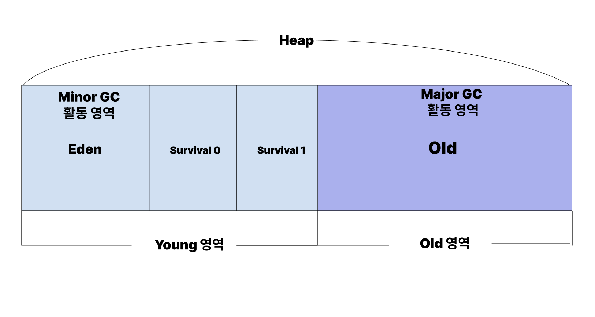

# Garbage Collection
## 정의
- 프로그램에서 더이상 사용하지 않는 객체를 찾아 자동으로 삭제하여 메모리를 확보하는 것
```java
    Person person = new Person();
    person.setName("김코딩");
    person = null; 
    // 가비지 발생
    person = new Person(); 
    person.setName("박해커");
```
- 위 코드에서 세번째를 보면, peson에 null이 할당됨으로써, 기존에 person 이 가리키던 인스턴스와 참조변수 간의 연결이 끊겼다.
- 이때, person의 존재이유가 사라지게 되고, 가비지 컬렉터가 메모리 점유를 해제한다.
- 정리하면
    - 프로그램이 실행 중일 때 `아무 것도 참조하지 않는 객체 및 변수를 검색하여 메모리 해제하여, 공간을 확보한다.`

## 동작 방식
- 동작 방식을 이해하려면 힙 메모리 영역을 이해해야 한다.
- 힙 영역의 객체는 대부분 일회성이며, 메모리에 남아 있는 기간이 짧다.
    - 그래서, 객체가 얼마나 살아있냐에 따라 힙 영역 내부가 나뉜다.
<br></img><br/>
- Young영역에서는 새롭게 생성된 객체가 할당된다. 여기서 활동하는 가비지 컬렉터를 Minor GC라고 한다.
- Old영역에서는 Young에서 오래 유지된 객체가 복사되는 곳으로, 가비지는 적게 발생한다. 여기서 활동하는 가비지 컬렉터는 Major GC이다.
- 가비지 컬렉션이 실행될때는 다음 2가지 단계를 따른다.
    1. stop the world
        - 가비지 컬렉션 실행을 위해 응용프로그램을 멈춘다.
        - 가비지 컬렉션을 실행하는 스레드를 제외한 모든 스레드가 중단되고, 완료 후 재개된다.
    2. mark and sweep
        - mark는 사용/미사용 메모리를 식별하는 작업
        - sweep은 사용 되지 않는 메모리를 제거하는 과정이다.