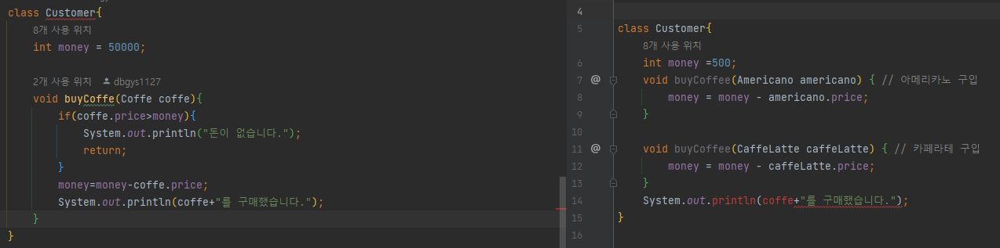

# 다형성
## 다형성이란?
- 다형성의 사전적 정의는 하나의 객체가 여러가지 형태를 가질 수 있는 성질을 의미한다.
- 자바에서 다형성은 한 타입의 참조변수를 통해 여러타입이 객체를 참조할 수 있도록 하는 개념
    - 다시말해, `상위 클래스 타입의 참조변수를 통해, 하위 클래스 객체를 참조할 수 있도록 허용한 것`
    ```java
        public class FriendTest {

        public static void main(String[] args) {
            Friend friend = new Friend(); // 객체 타입과 참조변수 타입의 일치
            BoyFriend boyfriend = new BoyFriend();
            Friend girlfriend = new GirlFriend(); // 객체 타입과 참조변수 타입의 불일치

            friend.friendInfo();
            boyfriend.friendInfo();
            girlfriend.friendInfo();
        }
    }
    ```
    - 위 코드를 통해 `Friend girlfriend = new GirlFriend();`를 보면 상위클래스 타입으로 생성한 참조변수가 사용할 수 있는 멤버의 개수는 상위클래스의 개수로 주는데, 다형성은 어떤 장점을 갖고 있을까? 
    - 다형성을 통해 매번 다른 타입의 참조변수를 객체 생성이나, 변경이 있을때 마다 해줘야하는 번거로움을 줄일 수 있다.
## 다형성의 특징
- 상위 클래스 타입으로 하위 클래스 타입의 객체를 참조는 되지만 `반대로 하위 클래스 타입으로 상위 클래스 객체를 참조할 수 없다.`
    - 그 이유는 `하위 클래스 멤버가 상위 클래스 멤버보다 많아서` 상위클래스가 자신에게 없는 멤버에 접근하지 못하기 때문이다.

- 다형성은 `오버라이딩, 오버로딩, 객체 변환, 추상클래스, 인터페이스를 통해, 구현`될 수 있다.
```java
public class FriendTest {

    public static void main(String[] args) {
        Friend friend = new Friend(); // 객체 타입과 참조변수 타입의 일치 -> 가능
        BoyFriend boyfriend = new BoyFriend();
        Friend girlfriend = new GirlFriend(); // 객체 타입과 참조변수 타입의 불일치 -> 가능
	//  GirlFriend friend1 = new Friend(); -> 하위클래스 타입으로 상위클래스 객체 참조 -> 불가능

        friend.friendInfo();
        boyfriend.friendInfo();
        girlfriend.friendInfo();
    }
}
```

# 참조 변수의 타입 변환
## 참조 변수의 타입 변환이란?
- 다형성을 가능케 하는 것 중 하나로, 타입변환은 `사용할 수 있는 멤버의 수를 조절이 가능하게`한다.

## 타입 변환 조건
1. 서로 상속관계에 있는 `상위클래스-하위클래스 사이` 에서 적용가능
2. 하위클래스 타입을 상위클래스 타입으로 변환시 형변환 연산자 `( )`를 생략할 수 있다.->업캐스팅
3. 상위 클래스에서 하위 클래스 타입으로 변환은 괄호를 반드시 붙혀야 한다->다운캐스팅
```java
public class VehicleTest {
    public static void main(String[] args) {
        Car car = new Car();
        Vehicle vehicle = (Vehicle) car; // 상위 클래스 Vehicle 타입으로 변환(생략 가능)
        Car car2 = (Car) vehicle; // 하위 클래스 Car타입으로 변환(생략 불가능)
        MotorBike motorBike = (MotorBike) car; // 상속관계가 아니므로 타입 변환 불가 -> 에러발생
        }
    }
```
# instanceof 연산자
## instanceof 연산자란?
- 참조변수 타입변환이 가능한지 여부를 boolean 타입으로 확인할 수 있는 연산자다.

## 캐스팅 가능여부 기준
1. `객체를 어떤 생성자로 만들었나`
2. `클래스 사이에 상속관계가 있는가`

## instanceof 장점
- 일일이 생성 객체 타입 확인이 어려울때 형변환 가능 여부를 확인하여 오류를 줄여준다.
```java
public class InstanceOfExample {
    public static void main(String[] args) {
        Animal animal = new Animal();
        System.out.println(animal instanceof Object); //true
        System.out.println(animal instanceof Animal); //true
        System.out.println(animal instanceof Bat); //false

        Animal cat = new Cat();
        System.out.println(cat instanceof Object); //true
        System.out.println(cat instanceof Animal); //true
        System.out.println(cat instanceof Cat); //true
        System.out.println(cat instanceof Bat); //false
    }
}

class Animal {};
class Bat extends Animal{};
class Cat extends Animal{};
```
## 다형성 장점
<br></img><br/>
- 코드를 보면 우측은 객체 타입변환 없이 Americano, CaffeLatte 객체를 Customer 클래스에 buyCoffe()메서드에 전달했고, 좌측은 상위 클래스인 Coffe로 타입변환 후 객체를 전달한 차이가 있다.
    1. 첫번째 장점은 만약, 커피가 두 종류가 아니라 수만가지라면, 우측 처럼 일일이 메서드를 재작성 해야하는 번거로움이 좌측에는 없다.
    2. 우측은 객체 이름이나, 내용의 변경이 생기면, buyCoffe()메서드에 해당부분을 다 수정해야하는 번거로움이 있으나, 좌측에는 없다.
    
