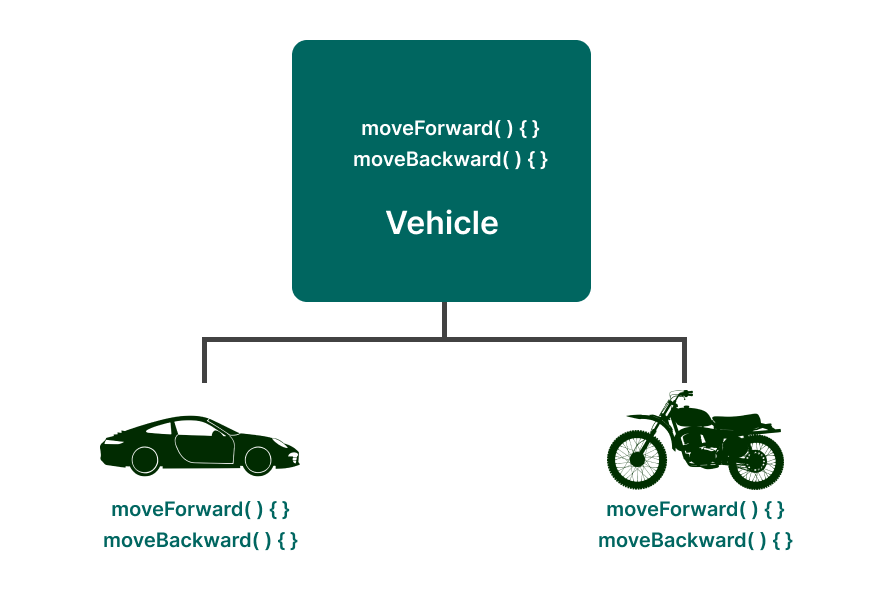
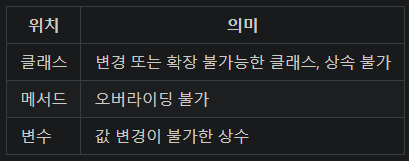

# 추상화
## 추상화란?
- 사전적으로는 `사물이나 표상을 어떤 성질, 공통성, 본질에 착안하여 그것을 추출하여 파악하는 것`
- 사전 정의에서 자바에 적용할 핵심 정의는 `공통성과 본질을 모아 추출하는 것`이다.
    - 추상화는 기존 클래스들의 `공통요소를 뽑아서 상위클래스`를 만들어 내는것이다.

   
## 추상화 특징
  
- 방향에 있어 상향인지, 하향인지는 중요하지 않다.
- 공통 속성과 기능을 정의해서 하위클래스를 만들 수 있고, 반대로 하위의 공통성을 모아 상위 클래스를 만들 수 있다.

# abstract 제어자
## abstract 제어자는?
- 쉽게 표현하면, `미완성 설계도`이다.
- 기타제어자의 하나로 주로 클래스와 메서드를 형용할 때 쓰인다.
- 메서드 앞에 붙으면 추상 메서드, 클래스 앞에 붙으면 추상 클래스가 된다.

## 추상 메소드는?
- 추상 메소드는 메소드명 앞에 abstract 기타제어자가 붙은 것이다.
- 추상 메소드는 메소드 시그니처만 있고, 바디가 비어있는 메서드이다.
- 추상 메소드는 바디가 완성되기전에는 객체 생성이 불가하다.

# 추상클래스
## 추상클래스 사용 이유
1. 상속 관계에 있어 새로운 클래스를 작성하는데 매우 유용하다.
    - 메서드를 다르게 사용할때, 구체적인 내용은 상속받는 하위 클래스에서 구현하게 하면, `설계 변화가 잦아도 유연하게 대응 할 수 있다.` -> `고치는 부분이 타 클래스에 영향을 안미치기 때문이다.`
2. 객체의 공통 속성과 기능을 추출하면, 여러 개발자가 참여시 공통속성/기능에도 불구하고 다른 `필드와 메서드로 구현되어 오류가 발생할 수 있다.`
    - 상속받은 클래스마다 메서드 내용(기능)을 달리 써야할때, 추상클래스가 없으면, 새로운 메서드를 계속 작성하면서, 반환타입이나, 이름 등이 틀리는 오류가 생길수 있다.
    - 추상클래스에서는 메서드 시그니처를 정해놓기 때문에, 틀리는 경우를 방지 할 수 있다.

## 추상클래스 특징
    - 상속 계층도에서 상위로 갈수록 `추상화 정도가 증가`/ `내려갈수록 구체화 정도가 증가` 한다.
    - 상층부에 가까울 수 록 더 공통적 기능/속성이 구현되어 있다.

# final 키워드
final은 사용위치에 따라 의미가 달라진다. 표만 잘 참고해두자.
 

