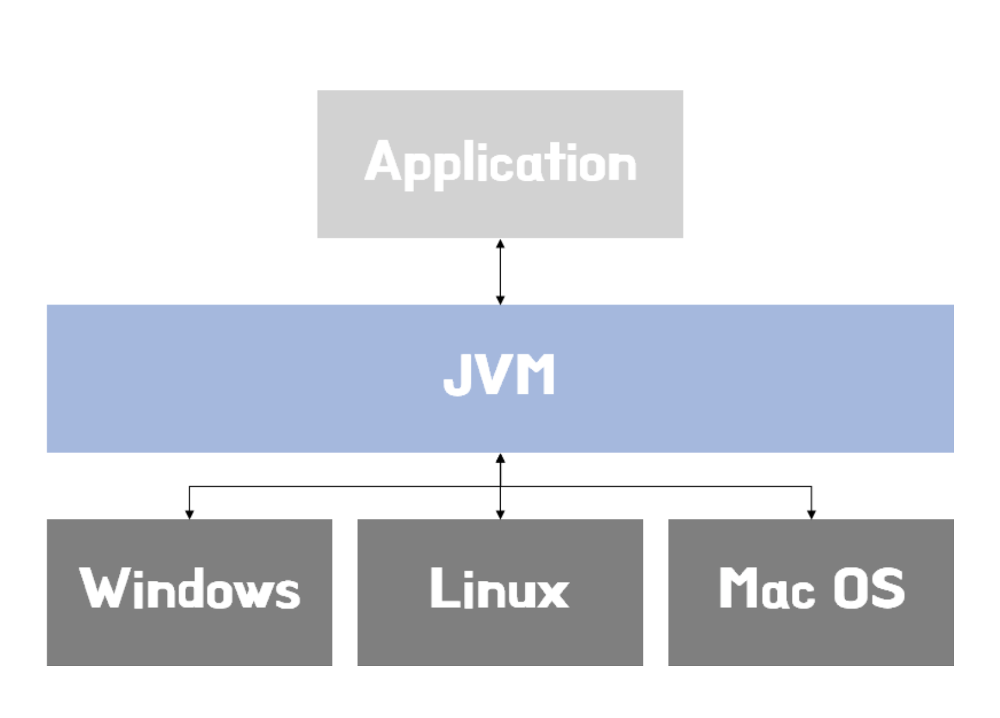
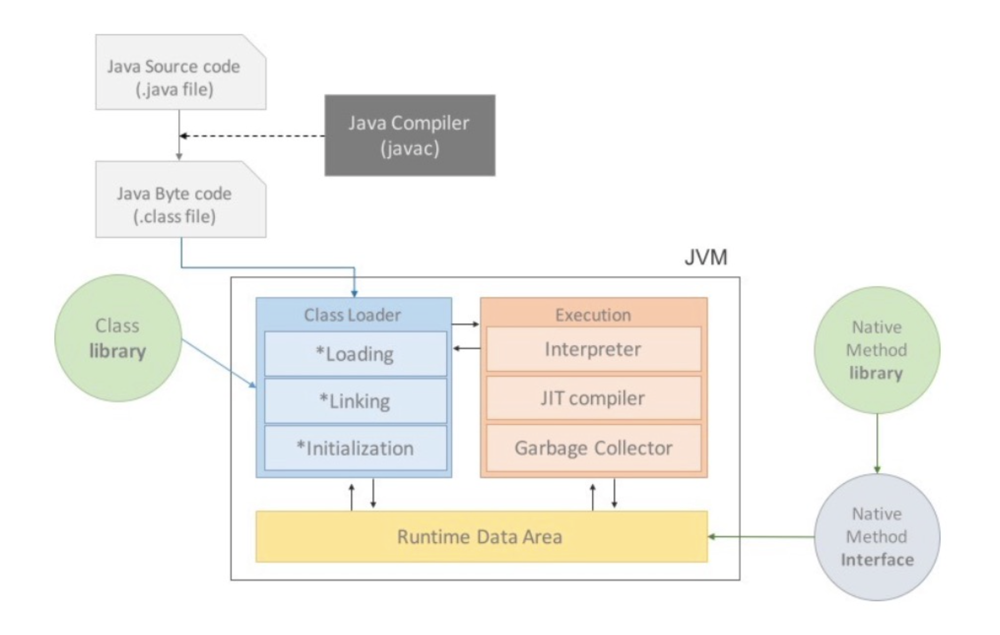
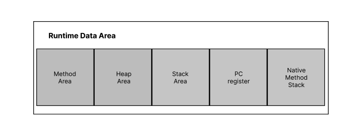
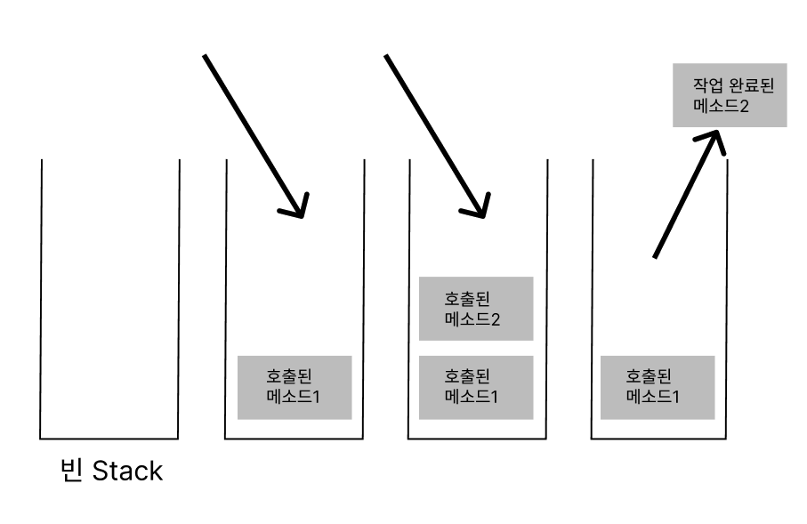
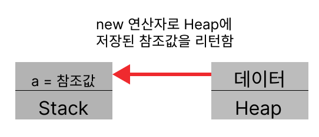

# 자바가상머신(JVM)
## 등장배경
- 자바 인전 유명 객체지향프로밍언어는 C++이 있었다.
- 하지만, C++은 `운영체제로 부터 독립적이지 못했다.`
    - 윈도우 응용프로그램은 윈도우에서만 사용가능
    - 즉, 응용프로그램을 운영체제별로 만들어야 했다.
- 운영체제로 부터 독립적일 수 없는 이유는
    - 프로그램 실행을 위해서 컴퓨터 자원을 할당 받기위해 자원을 요청해야 한다.
    - `그 요청 방식이 운영체제마다 달랐다.`

## 자바가상머신 등장
- 자바가상머신은 자바프로그램을 실행시키는 도구이다.
- 자바로 작성한 `소스코드를 해석해 실행`하는 별도의 프로그램이다.
- 자바프로그램과 OS사이 `통역역할`을 한다.
- 이 때문에, 자바가 독립성을 갖게 되었다.
- 자바가상머신은 각 OS에 적합한 버전이 있다.
<br></img><br/>

## 자바가상머신 동작
<br></img><br/>

1. 자바소스 코드를 빌드하면 컴파일이 완료된다.
2. 그 결과 `.class`파일이 만들어진다.
3. 이때 JVM의 클래스 로더가 클래스 파일을 불러들여 JVM이 동작한다.
4. 이후 Runtime Data Area에 데이터가 들어가 프로그램이 실행된다.

# Stack, Heap 
## JVM 메모리 구조
<br></img><br/>

- JVM에 자바 프로그램이 로드되어 실행될때, 데이터들이 메모리에 저장되는데 크게 5가지 영역으로 구분되어 저장된다.

## Stack 영역이란?
<br></img><br/>
- 먼저, Stack는 자료구조 중 하나로 자료구조는 `프로그램이 데이터를 저장하는 방식`을 의미한다.
- 스택은 `LIFO=Last In First Out`이란 뜻으로 맨 마지막에 들어온 데이터가 가장 먼저 나가는 자료 구조이다.

### Stack 동작
- `메서드가 호출되면 그 메서드를 위한 공간인 Method Frame이 생성`되고 `메서드 내부에서 사용하는 다양한 값들이 임시로 저장된다.`
- Method 동작이 완료되면 `역순`he으로 데이터가 제거된다.

## Heap 영역이란?
<br></img><br/>

- JVM에는 단 하나의 Heap 영역이 있다.
- JVM이 작동하면 이 영역은 자동으로 생성되면 객체, 인스턴스 변수, 배열이 저장된다.
```java
    Person person = new Person();
```
- 위 코드에서 new Person() 이 실행되면, 힙 영역에 인스턴스가 생성되며, 인스턴스가 생성된 위치의 주소값을 person에게 할당해주는데, 이 person은 Stack 영역에 선언된 변수이다.
- 즉, 객체를 다룬다는 것은 `스택영역에 저장된 참조변수`를 통해 `힙 영역에 존재하는 객체를 다룬다는 뜻`이다.
- 힙 영역에는 실제 `객체 값이 저장`된다.