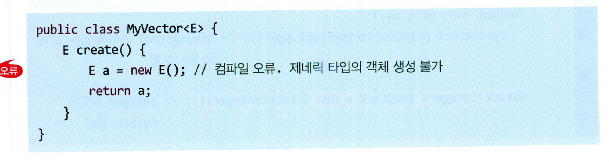

# 제너릭
## 제너릭이란?
- 사전적으로 `일반적인`이란 뜻을 갖고 있다.
- 자바에선 클래스나 메서드의 코드를 작성할때, `타입을 구체적으로 지정하는 것이 아니라`, `추후에 지정할 수 있게 일반화해 두는 것`을 의미 
- 다시말해, 클래스 또는 메서드가 `특정 데이터 타입에 얽메이지 않게 하는 것`이다.
- 제너릭은 클래스와 메서드에서 사용가능하다.

<br>

# 제너릭 클래스
## 작성법
```java
class 클래스명 <타입매개변수(제너릭 변수)=T>{
    private T 변수명;
}
===만약 여러 타입의 매개변수를 받는다?===
class 클래스명 <K,V>{
}
```
- 보통 Type, Key, Value를 의미하는 `T, K, V`를 쓰고, 이외에 Element, Number, Result를 의미하는 `E, N, R`을 쓴다.

## 제너릭 클래스 사용법
- 멤버를 구성하는 코드에 `특정 타입이 지정되지 않은 클래스`다.
- 타입(타입매개 변수)은 언제 정해질까?
    - 제너릭 클래스를 인스턴스화 할때, 참조변수의 타입을 정할 때 정해진다.
- 인스턴스화(구체화) 방법
```java
클래스명<타입> 참조변수명 = new 클래스명<타입>();
===생략가능===
클래스명<타입> 참조변수명 = new 클래스명<>();
```
- 다형성에도 적용이 가능하다.
```java
class Flower { ... }
class Rose extends Flower { ... }
class RosePasta { ... }

class Basket<T> {
    private T item;

    public T getItem() {
        return item;
    }

    public void setItem(T item) {
        this.item = item;
    }
}

public static void main(String[] args) {
		Basket<Flower> flowerBasket = new Basket<>();
		flowerBasket.setItem(new Rose());      // 다형성 적용
		flowerBasket.setItem(new RosePasta()); // 에러
}
```

- 위 코드에서 `main`메서드에 코드를 보면, Flower나 상속받은 클래스를 제너릭 클래스에 전달할 수 있다. 이로써, getter를 이용하면, Flower나 Rose 멤버에 접근할 수 있다.

## 주의할 점
- 클래스 변수에는 `타입 매개변수를 쓸 수 없다.` 왜???
    - 클래스변수는 모든 인스턴스, 혹은 참조변수 없이 쓸 수 있고, 공유가 된다는 특징이 있다.
    - 만약 클래스 변수에 타입매개변수를 쓸 수 있다면, `서로 타입이 바뀌어 공유의 특징이 사라지기 때문이다.`->`고유의 것이 되기 때문`
    - 따라서, static이 붙은 클래스 변수는 타입 매개변수를 사용할 수 없다.
    ```java
    class Basket<T> {
	private T item1; // O 
	static  T item2; // X 
    }
    ```
- 제너릭 구체화(인스턴스화)에 기본 타입은 사용 불가하다.

- 제너릭 클래스내에서 `제네릭 타입을 가진 객체 생성은 허용되지 않는다.`

    - 왜냐하면? 컴파일러가 MyVector<E>클래스의 new E()라인을 컴파일할 때, E에 대한 `구체적은 타입을 알 수 없어, 호출될 생성자를 결정하지 못한다.`
    - 객체생성 시 `어떤 크기의 메모리를 할당할지 모르게 된다.`
- 제너릭 클래스 내에서 제너릭 타입의 객체를 생성할 수 없는데, 배열 같은게 필요하는 어떻할지?
    - 우선 `Object로 생성하고, return할때 제너릭 타입(타입매개변수)로 캐스팅 하면 된다.`
    ```java
    class GStackk<T>{
    int tos;
    Object [] stck;
    ...
        public T pop() { 
            if (tos == 0)
                return null;
            tos--;
            return (T) stck[tos];
        }
    }
    ```
- 제너릭 클래스 참조변수 선언할때나, 인터페이스 타입의 배열은 선언할 수 없다.
= `객체 배열을 선언할 수 없다.`
    ```java
    GStack<Integer>[]gs = new GStack<>[10];
    ```
- 하지만, 메서드내에서 제너릭 타입의 배열 선언은 된다.
    ```java
    public void myArray(T[] a){...}
    ```
    - 즉, 메서드를 호출할 때, 인자로 배열은 가능하다는 얘기다.

## 제한된 제너릭 클래스
```java
class Basket<T extends Flower>{...}
```
- 이렇게 선언하면, `Flower의 하위 클래스만 지정하도록 제한`한다.

```java
class Basket<T extends Plant>{...}
```
- 이때, Plant는 인터페이스 인데, `특정 인터페이스를 구현한 클래스만 타입으로 지정하게 제한`한다.
```java
class Basket<T extends Flower&Plant>{...}
```
- 이렇게 선언하면, Flower와 Plant를 둘다 가진 클래스만 사용할 수 있게 제한된다.
    - `특정 클래스와 인터페이스를 둘다 가진걸로`

<br>

# 제너릭 메서드
## 제너릭 메서드란?
- 클래스 내부의 특정 `메서드`만 제너릭으로 선언 할 수 있다.
    - 이를 제너릭 메서드라 한다.

## 작성법
```java
class Basket{
    public <T> void add(T element){...}
}
```
- 제너릭 메서드의 타입매개변수 선언은 반환 타입 앞에서 이뤄진다.
## 사용법(호출법)
```java
클래스명.<타입매개변수>메소드명{}
======타입매개변수 생략가능 =======
Object[]oArray = new Object[100];
GStack<Object> objectStack = new GStack<Object>();
GenericMethodEx.toStack(oArray, objectStack);//타입 매개변수 T를 Object로 유추함
```
- 제너릭 메서드의 타입매개변수는 추출할 때, 메소드 인자로 타입을 유추할 수 있어 생략할 수 있다.
- 해당 메서드 내에서만 선언한 타입 매개변수를 사용할 수 있다.
```java
class Basket<T> {                        // 1 : 여기에서 선언한 타입 매개변수 T와 
		...
		public <T> void add(T element) { // 2 : 여기에서 선언한 타입 매개변수 T는 서로 다른 것입니다.
				...
		}
}
```
## 주의사항
- `제너릭 메서드의 타입 매개변수는 제너릭 클래스의 타입 매개변수와 별개다.`
    - 이유는 타입이 `지정되는 시점이 다르기 때문이다.`
    - 즉, 제너릭 클래스의 타입매개변수는 클래스가 `인스턴스화 될때 타입이 지정`된다.
    - 반면 제너릭 메서드는`메서드가 호출 될 때 이뤄진다.`
- static 키워드로 선언되는 `클래스 메소드로 선언`이 가능하다.
- 제너릭 메서드는 메서드가 호출될 때 타입매개변수가 결정되므로, 정의할 때는 어떤 타입이 입력될지 알 수 없다. 따라서, `제너릭 메서드 바디에서는 클래스 메서드를 쓸 수 없다.`
    - 단, `최상위 클래스인 Object클래스의 메서드`는 제너릭 메서드 바디에서 사용 가능 하다.

## 시점별 타입매개변수의 소속
```java
class Basket<T>{
    private T round;//->1
    public void push(T item){...}//->2
    public <T> void add(T elment){...}//->3
    public <T> T get(T a){...}//->4
    public <T> Flower<T> set(T a){...}//->5
}
```
1. 제너릭 클래스의 타입 매개변수로 선언된 필드이며, 제너릭 클래스가 인스턴스화 될때 정해짐
2. 제너릭 클래스의 타입 매개변수로 선언된 메서드이며, 제너릭 클래스가 인스턴스화 될때 정해짐
3. 제너릭 메서드이며, `<T>=타입매개변수`로 매개변수의 타입을 정한다. 제너릭 메서드가 호출 될때, 인자값에 따라 정해진다.
4. 제너릭 메서드이며, `<T>=타입매개변수`이며 매개변수 타입을 정한다. 그 다음 `T`는 반환 타입을 정하나, 제너릭 클래스의 인스턴스화가 진행될 때, 생기는 제너릭 클래스 타입매개변수이다. 제너릭 메서드가 호출될때, 인자값에 따라 정해진다.
5. 가운데, `Flower<T>`에서 `T`는 제너릭 클래스의 인스턴스화가 진행 될때, 생기므로, 제너릭 클래스 타입매개변수이다.
