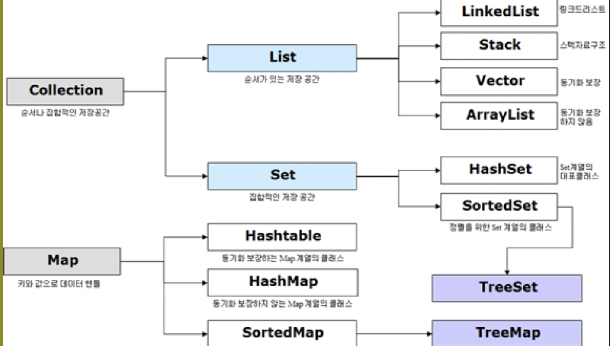
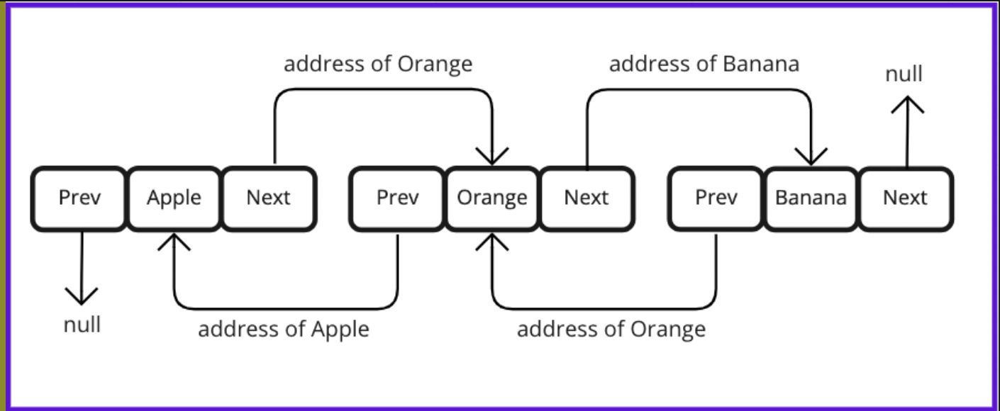
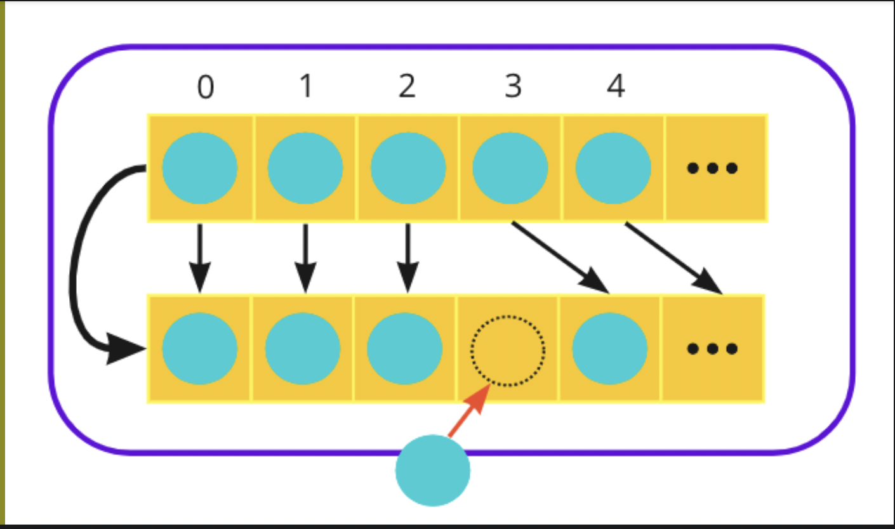
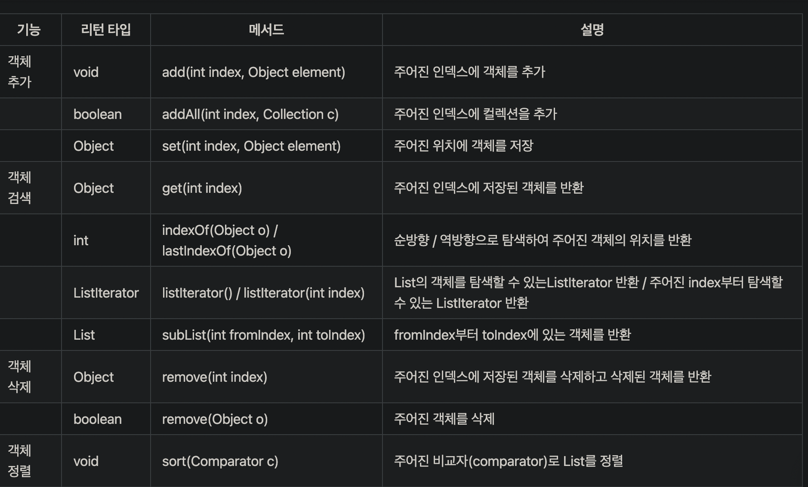
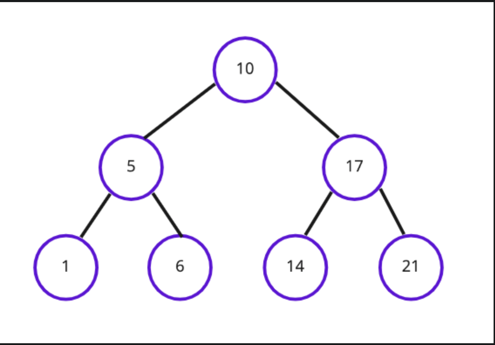
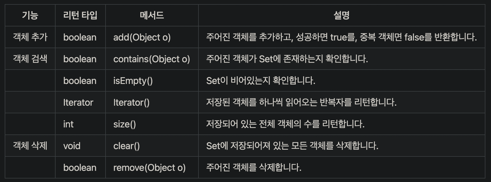
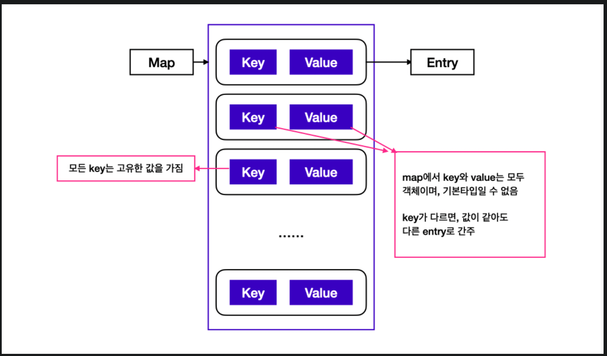
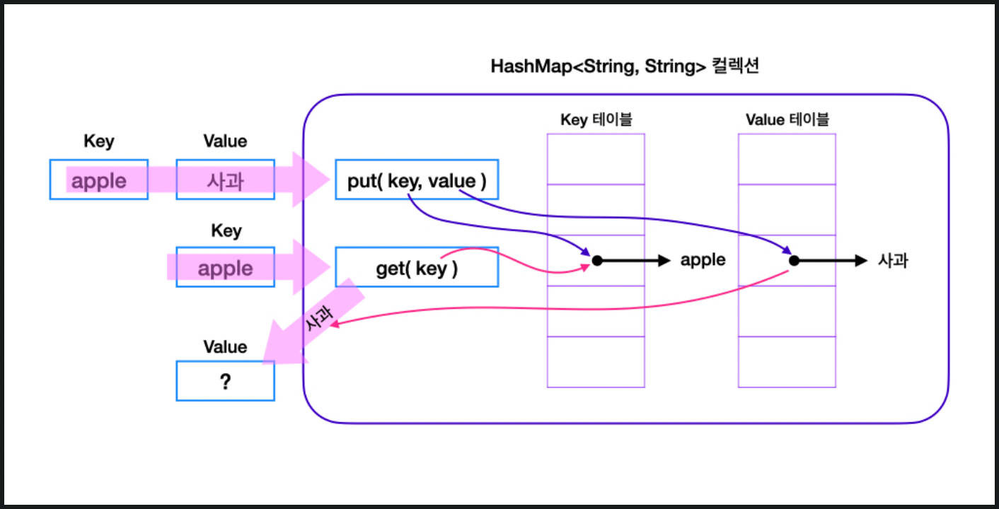
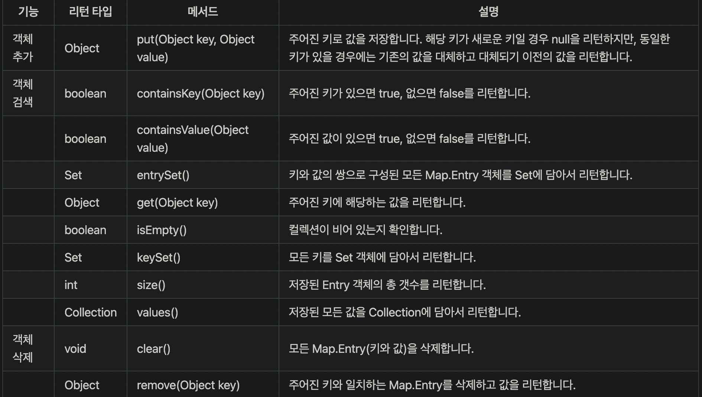

# 컬렉션 프레임워크
## 컬렉션 프레임워크란?
- 컬렉션은 여러 데이터들을 그룹으로 묶어놓은 것
- 이 컬렉션을 다루기 편리한 메서드를 정의해놓은 것이 컬렉션 프레임워크
- 주로 데이터 추가, 삭제, 수정, 검색 등의 기능을 갖춤
## 컬렉션 프레임워크 구조

- 간략하게 구성요소들의 특징을 보자.
- List
    - 데이터 순서 유지, 중복저장 가능
- Set
    - 데이터 순서 유지 불가, 중복저장 불가
- Map
    - Key와 Value의 쌍으로 데이터를 저장한다.
    - 데이터 순서 유지 불가, Key는 Value를 읽는 식별 용도로 중복이안된다.
    - Value는 중복저장 가능

# List<E>
## List<E> 특징
- 배열처럼 객체를 `일렬로 늘어놓는 구조`이다.
- 객체를 인덱스로 관리하기 땜에, `객체가 저장되면 자동으로 인덱스가 부여`되고, 인덱스를 검색, 추가, 삭제 할 수 있다.
- 배열과 다른 점은 배열은 선언 시 크기가 정해지며, 변경이 불가하지만, `List는 용량이 추가하면, 자동으로 커진다.`

## ArrayList
- 객체가 인덱스로 관리된다. 
- 객체를 추가하면 `인덱스 0번 부터 추가`된다.
- 겍체를 제거하면 `삭제한 인덱스 바로 뒤부터 당겨진다.`
- 따라서 객체 삽입, 제거가 빈번할 때 적합하지 않다.
- `순서대로 삽입, 삭제할때 적합`하다.

## LinkedList

- 데이터 `추가, 삭제, 변경에 효율적이다`.
    - 배열과 ArrayList는 데이터가 연속적으로 있지만,
    - LinkedList는 불연속적이며, 데이터끼리 `Prev/Next`를 구분하는 노드로 연결되어 있다.
    - 각요소(node)가 자신과 연결된 이전요소 및 다음 요소의 주소값과 데이터로 구성되어 있다.=== `(이전요소 주소)+(요소)+(다음요소 주소)`
- 데이터를 삭제하려면 삭제하고자하는 요소의 이전요소가 삭제하고자하는 요소의 다음요소를 참조하도록 변경하여야 한다.
    - 그림에서 Orange를 삭제하려면 Apple의 다음 주소값이 Banana와 연결되어야 하고, Banana의 이전 주소가 Apple의 주소값과 연결되어야함.
- 배열처럼 데이터 이동을 위해 복사할 필요가 없어 처리속도가 빠르다. 

## ArrayList vs LinkedList

- ArrayList의 데이터를 추가하는 상황을 보면, `데이터 추가 또는 삭제시 데이터를 복사해서 이동하는 과정이 생긴다.` 이런 이유로, 순차적인 삭제, 삽입은 빠르지만, 중간에 위치한 데이터의 삭제, 삽입은 속도가 느리다.

- 반면 LinkedList는 `이전/다음이 저장되어 있는 주소만 바꾸면 되서`, 중간 데이터 삭제, 삽입이 빠르다.

## List 메서드

# Iterator
## Iterator 은?
- 객체를 일렬로 늘어놓은 구조에서 순서대로, 객체를 전부 읽어 오는 것
- 메서드는, hasNext(), next(),remove()가 있으며, 이 부분은 생략하겠다.

# Set
- Set은 요소의 중복을 허용하지 않고, 저장순서를 유지하지 않는 컬렉션이다.
## HashSet
- HashSet은 Set 인터페이스를 구현한 가장 대표적인 컬렉션 클래스다. 
- HashSet에 값을 추가할 때, 해당 값이 중복된 값인지 어떻게 판단할까? 
    - add(Object o)를 통해 객체를 저장하고자 합니다.
    - 이 때, 저장하고자 하는 `객체의 해시코드를 hashCode() 메서드`를 통해 얻는다.
    - Set이 저장하고 있는 `모든` 객체들의 해시코드를 hashCode() 메서드로 얻는다.
    - `저장하고자 하는 객체의 해시코드와, Set에 이미 저장되어져 있던 객체들의 해시코드를 비교하여, 같은 해시코드가 있는지 검사한다.`
    - 만약 같은 해시코드를 가진 객체가 존재한다면 저장하고자 했던 객체가 중복 객체로 간주되어 Set에 추가되지 않으며, `add(Object o) 메서드가 false를 리턴`
    - 같은 해시코드를 가진 객체가 존재하지 않는다면, Set에 객체가 추가되며 add(Object o) 메서드가 `true를 리턴`
## TreeSet
- TreeSet은 이진 탐색 트리 형태로 데이터를 저장
- 이진 탐색 트리(Binary Search Tree)란 하나의 부모 노드가 최대 두 개의 자식 노드와 연결되는 이진 트리(Binary Tree)의 일종으로, 정렬과 검색에 특화된 자료 구조이다.
- 이진 탐색 트리는 `모든 왼쪽 자식의 값이 루트나 부모보다 작고, 모든 오른쪽 자식의 값이 루트나 부모보다 큰 값을 가지는 특징`이 있다.

## Set 메소드

# Map

- Map을 사용할 때에 중요한 사실은 키는 중복 저장될 수 없지만, 값은 중복 저장이 가능하다는 것입니다. 이는 키의 역할이 값을 식별하는 것이기 때문이다

- 만약 기존에 저장된 키와 동일한 키로 값을 저장하면, 기존의 값이 새로운 값으로 대치됨
## HashMap

- HashMap은 `해시 함수를 통해 키와 값이 저장되는 위치를 결정`하므로, 사용자는 `그 위치를 알 수 없고, 삽입되는 순서와 위치 또한 관계가 없다.`

- HashMap은 이름 그대로 해싱(Hashing)을 사용하기 때문에 `많은 양의 데이터를 검색하는 데 있어서 뛰어난 성능이 특징이다.`
## Map 메소드

