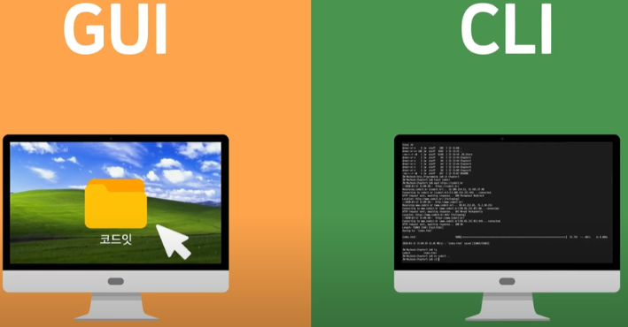
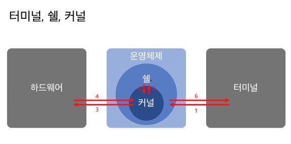
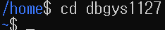
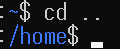
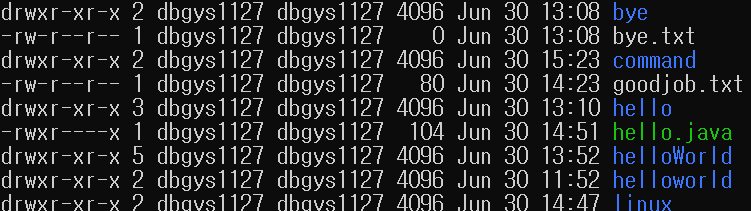
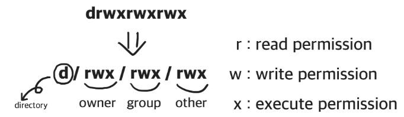
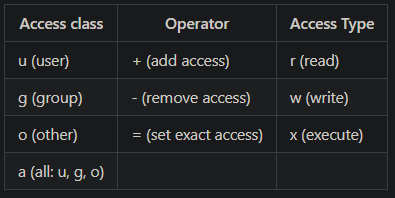
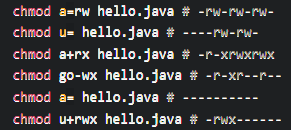
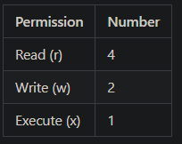
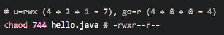

## CLI와 GUI는 무엇인가?
***
- GUI는 윈도우나 mac에서 컴퓨터를 그래픽으로 입출력 제어하는 운영 방식이다.
- CLI는 리눅스에 적용된 명령줄 제어 방식이다.
- CLI의 장점 : GUI는 그래픽에 자원을 많이 쓰는데, CLI는 그래픽 작업을 안해서 자원을 덜 쓴다.

## 커널, 쉘, 하드웨어, 터미널의 관계

- 그림을 통해 커널, 쉘, 하드웨어, 터미널의 관계를 이해해보자
    - 1 단계 : 사용자가 명령어를 입력
    - 2 단계 : OS안에 쉘이 커널이 알아 들을 수 있게 해석을 한다.
    - 3 단계 : 커널이 명령을 수행해서 명령대로 하드웨어를 제어한다.

## 리눅스는 왜쓰는가?
***
- 개발자가 만들고 운영될 응용프로그램의 서버는 서버 컴퓨터에 저장된다.
- 서버 컴퓨터는 일반 컴퓨터 보다 많고, 많은 컴퓨터에 mac 같이 비싼 컴퓨터나, 윈도우 처럼 비싼 이용료를 내고 쓸 수 없기 때문에, 무료인 리눅스를 사용한다.
다시말해, **웹서비스의 서버 컴퓨터는 리눅스로 동작**하고 이 점이 개발자가 리눅스를 공부해야하는 이유중 하나다.

## 관리자 권한과 경로
***
### 사용자와 관리자 구분 필요성
- 리눅스의 사용자와 관리자를 알아보기전에, 사용자와 관리자 등장 배경을 생각해보자.
- 윈도우엔 처음에 관리자만 있었다. 관리자 권한은 프로그램 설치, 변경, 삭제를 할 수 있는데, 사용자가 사용도중 **악성코드와 같은 프로그램이 설치 되도 파악하거나 앞서 막을 수 있는 장치가 없었다.** 이러한 외부 위협에서 보호하기 위해 사용자 권한으로 사용 시에는 방화벽이 실행되어 사용자 정보를 탈취하는 것을 막았다.

### 리눅스의 관리자
- 리눅스는 윈도우 보다 먼저 사용자와 관리자를 구분하였다.
- 윈도우와 구분되는 점은 사용자가 절대 관리자 권한에 접근 할 수 없도록 구분해두었다.
- 다만 필요할때는 `sudo` 명령으로 권한을 빌려야 한다.

### 관리자 권한
- 리눅스에는 관리자 처럼 프로그램, 파일, 폴더를 생성, 변경, 삭제할 수 있는 폴더가 있다. 
- 아래 그림처럼 '~' 표시가 있는 디렉토리가 사용자 폴더로 관리자 권한을 제한적으로 얻는다.
 

 
- 아래 그림처럼 '/'로 시작되면 현재 관리자 권한 디렉토리에 있다는 뜻으로, 루트 권한이라고 한다.   

 
- 사용자 영역에서 파일이나, 폴더를 생성할 수 있는데, 이때, 관리자 권한으로도 생성할 수 있다.
- `sudo`를 CLI 이전에 기입하면 된다. 이때, 어떤 권한으로 생성 되었는지 확인 하기 위해서 `ls -l`을 기입해보면 username(사용자)/root(관리자)가 나온다.

### 절대 경로와 상대 경로
- 경로는 `pwd`를 통해서 확인할 수 있으며, 절대 경로와 상대 경로가 있다.
- 절대 경로 : '/'는 루트폴더 부터 현재 작업중인 폴더까지 어떻게 진입할 수 있는지 알려준다.
- 상대 경로 : 현재 위치를 기준으로 '.'을 이용해서 디렉토리를 이동할 수 있다.

### 사용 권한
프롬프트 창에 `ls -l`을 입력해보면, 아래와 같은 문자를 볼 수 있다.

좌측에 -rw--r--r을 쪼개서 보면 다음과 같은 의미를 가진다.

#### user, group, other
- 첫 문자(-/d): '-'는 파일이라는 뜻, 'd'는 디렉토리라는 뜻
- 2~4 : 소유자의 영역이며, 소유자 혹은 user는 파일이나, 폴더를 만든 사람이다.
- 5~7 : 그룹 영역이며, 그룹은 많은 사람이 파일에 접근하는 프로젝트에서 group 속성을 수정하면 된다.
- 8~10 : other의 영역이며, other은 모든 사람에게 설정되는 권한이다.

#### 권한
- 2~10에 있는 -, r, w, x 는 각 그룹이 파일이나, 폴더에서 할 수 있는 권한을 의미한다.
    - r : 읽기 권한
    - W : 쓰기 권한
    - x : 실행 권한
    - `-` : 권한 없음
- 권한을 부여하는 명령어는 `chmod` 이며, user, group, other에 권한을 부여하는 방식은 Symbolic method와 Absolute form이 있다.
    - Symbolic method   
    
    
    - Absolute form   
       
    

## 패키지와 패키지 매니저
***
- 패키지 : 여러 파일을 모아 하나의 파일로 저장하고 있는 압출파일이다. 여기에는 프로그램이 정상작동하기 위한 모든 파일이 압축되어 있다.
    - 그런데, 패키지만 존재할 경우, 사용자가 어떤 프로그램을 설치, 변경, 삭제 하고 싶다면, 그 프로그램의 저장소에 직접 접근해야하는데, 이것은 불가능에 가깝다.
- 패키지 매니저 : 패키지 설치, 변경, 삭제 등의 관리하는 역할을 하며, 앱스토어에 빗대어 생각하면, 편하다.
gg