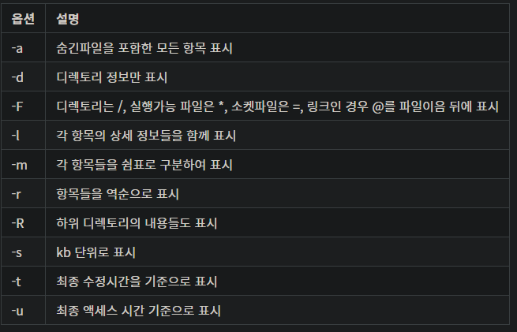
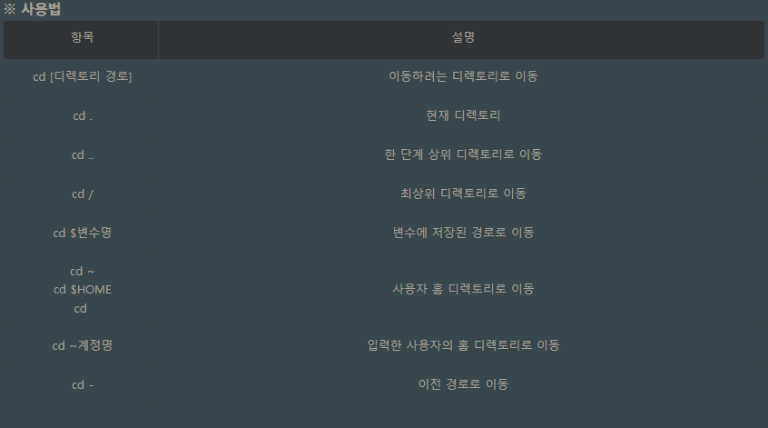
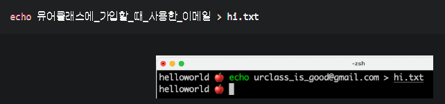
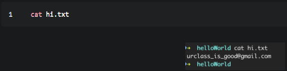

## 주요 명령어
***
- pwd(print work directory) : 현재 작업 중인 경로를 출력한다.
- mkdir(make directory) [folder] :'folder' 폴더를 생성해준다. 
- ls(list) : 특정 폴더에 포함된 파일과 폴더를 출력하며, 옵션은 다음과 같다.   

- cd : 폴더에 접근하는 명령어   

- touch : 파일을 생성할 때 쓰는 명령어
- `>` : 실행 결과를 파일로 저장하기   

- cat : 파일의 내용을 터미널에 출력하기   

- rm : 폴더나 파일 삭제하기, 폴더를 삭제할때는 -r 옵션을 써야 한다.f는 질문을 받지 않고 지울 때 사용한다.
- mv : 폴더나 파일의 이름을 변경, 혹은 위치를 옮길때 사용
- cp : 폴더나 파일을 복사할때, 사용. 폴더를 복사할때는 -r 옵션을 써야 한다.f는 질문을 받지 않고 지울 때 사용한다.

## 심화 명령어 링크
- [파일, 디렉터리 조작을 위한 기본 명령어들](https://www.44bits.io/ko/post/linux-and-mac-command-line-survival-guide-for-beginner#%ED%8C%8C%EC%9D%BC-%EB%94%94%EB%A0%89%ED%84%B0%EB%A6%AC-%EC%A1%B0%EC%9E%91%EC%9D%84-%EC%9C%84%ED%95%9C-%EA%B8%B0%EB%B3%B8-%EB%AA%85%EB%A0%B9%EC%96%B4%EB%93%A4)