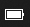

# 1. 헤더(HEADERS)

- 큰제목 : 문서 제목  12  ddd
    문서의 제목을 표시 할때는 `===`을 사용.
    ```
    Title
    ===
    ```
    Title
    ===
    </br>
    
- 작은제목 : 문서 부제목    
    문선의 부제목을 표기 시 `---`을 기입.
    ```
    Sub title
    ---
    ```
    Sub title
    ---
    </br>

- 글머리: #의 개수에 따라, 1~6까지 크기를 제공하며, 개수가 작을수록 큰글씨다.    
    ```
    # 1단계
    ## 2단계
    ### 3단계
    #### 4단계
    ##### 5단계
    ###### 6단계
    ```
    # 1단계
    ## 2단계
    ### 3단계
    #### 4단계
    ##### 5단계
    ###### 6단계
    </br>
# 2. 인용
인용이나, 제목에 대한 간단한 설명을 하고 싶다면, `>`를 사용한다.
```
> 잠은 죽어서 자면 된다.
>> 성인은 하루 7시간 이상 수면시간이 필요하다.
>>> 어쩌라는거야?
```
> 잠은 죽어서 자면 된다.
>> 성인은 하루 7시간 이상 수면시간이 필요하다.
>>> 어쩌라는거야?
</br>


# 3. 목록
순서 있는 목록은 `숫자 + .`을 사용한다.
```
1. 첫번째
2. 두번째
3. 세번째
```
1. 첫번째
2. 두번째
3. 세번째

단, 숫자를 순서대로 입력 안해도 알아서 순서를 맞춘다.
```
1. 첫번째
3. 두번째
2. 세번째
```
1. 첫번째
3. 두번째
2. 세번째

</br>
숫자로 목록 표시 외, `*, -, +`를 사용할 수 있다.

```
- 한국
  - 서울
    - 강남
```
- 한국
  - 서울
    - 강남

```
+ 축구
  + 프리미어리그
    + 리버풀
```
+ 축구
  + 프리미어리그
    + 리버풀

```
* 음식
  * 한식
    * 삼겹살
```
* 음식
  * 한식
    * 삼겹살

`참고`로 혼합도 가능하다.

</br>

# 4. 코드블럭
백킥 `(~표시 아래)을 " ``` " 형태로 원하는 코드를 감싸면 블럭이 생긴다. 또한  시작점에 언어를 선언하면 문법 강조가 된다.

```Java
public class BootSpringBootApplication{
    public static void main(String[] args){
        System.out.println("Hello, world");
    }
}
```

</br>

# 5. 수평선
아래 기호는 모드 수평선을 만들 수 있다. 페이지 나눌 때, 유용하다.

```
* * *
***
*****
- - -
----------------
```
* * *
***
*****
- - -
----------------
</br>

# 6. 링크
- 하이퍼링크처럼 문자에 링크를 바로 입히고 싶을때, `[링크 제목]+(주소)` 형태로 쓰면 된다.
    ```
    [Google](https://www.google.com/)
    ``` 
    [Google](https://www.google.com/)

- 인용한 링크를 안내하고 싶을땐, "<주소>" 형태로 쓰면된다.
    ```
    외부링크: <https://www.naver.com/>
    ```
    외부링크: <https://www.naver.com/>

</br>

# 7. 강조
```
*기울이기*
_기울이기_
**볼드**
__볼드__
~~선긋기~~
***기울이고 볼드***
```
*기울이기*  
_기울이기_  
**볼드**    
__볼드__    
~~선긋기~~    
***기울이고 볼드***

</br>

# 9. 이미지
이미지를 삽입할때는 `![이미지 설명]+(경로)`
```

```
  


크기를 조정하고 싶다면?
```
</img><br/>
</img><br/>
```
</img><br/>
</img><br/>

</br>

# 10. 줄 바꿈
`3칸` 혹은 `Tab`키를 입력 후 `enter`를 눌러야 줄이 바뀐다.
```
줄 바꿈을 하기 위해서는 문장 마지막에서 3칸이상을 띄어쓰기해야 한다.___ 
이렇게
```
줄 바꿈을 하기 위해서는 문장 마지막에서 3칸이상을 띄어쓰기해야 한다.  
이렇게

</br>

# 11. 표
표를 만들기 위해서는 `|내용|` 형태로 만들면 된다.
```
|순위|로고|팀|승점|
|--|--|--|--|
|1|이미지|ManCity|70|
```
|순위|로고|팀|승점|
|--|--|--|--|
|1|이미지|ManCity|70|

또한 `:`을 어디 붙히냐에 따라 좌, 우, 가운데 정렬이 가능하다.
```
|순위|로고|팀|승점|
|--:|:--|:--:|:--|
|1|이미지|ManCity|70|
```
|순위|로고|팀|승점|
|--:|:--|:--:|:--|
|1|이미지|ManCity|70| 

끝으로, 이미지를 넣고 싶다면, 해당 칸에 `|![이미지 성명]+(링크)|`를 기입하면 된다.

```
|순위|로고|팀|승점|
|:--:|:--:|:--:|:--:|
|1||ManCity|70|
|2||Liverpool|69|
|3||Chelsea|59|


```
|순위|로고|팀|승점|
|:--:|:--:|:--:|:--:|
|1||ManCity|70|
|2||Liverpool|69|
|3||Chelsea|59|

</br>

## 참고
이 글은 다음과 같은 글 및 영상을 따라해서 작성했습니다.
1. :+1: **ihoneymon** 님의 [마크다운 작성법](https://bit.ly/3DmvDvQ)
2. :+1: **유튜버 드림코딩 by엘리**님의 [마크다운(Markdown) 6분 순삭 정리 + 깃허브 리드미(ReadMe) 파일 작성 팁](https://bit.ly/35rUS3C) 