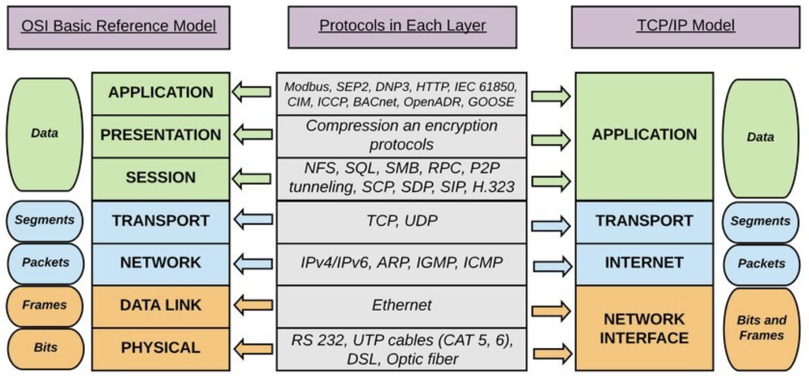
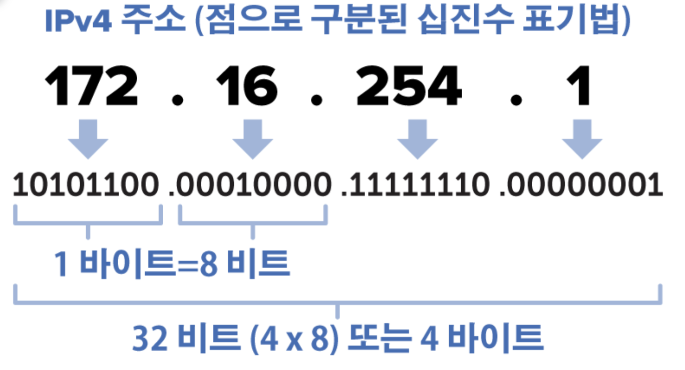
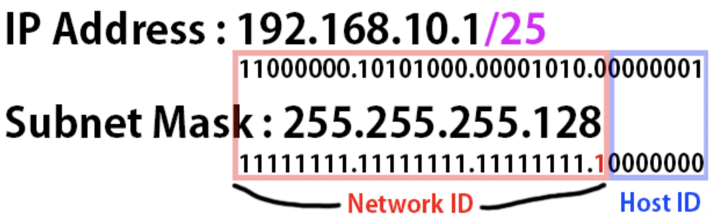
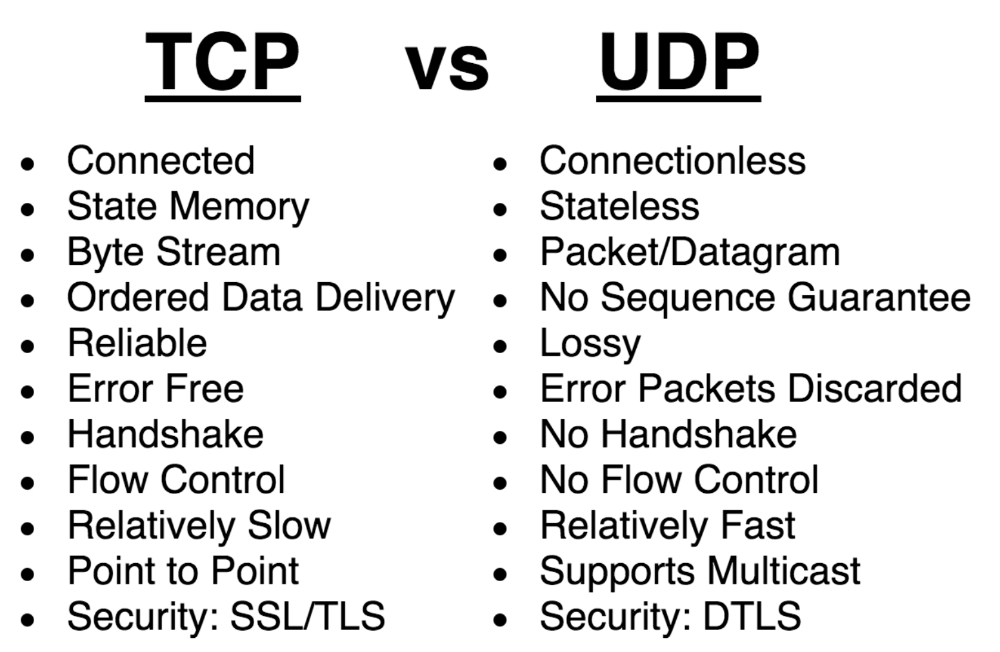
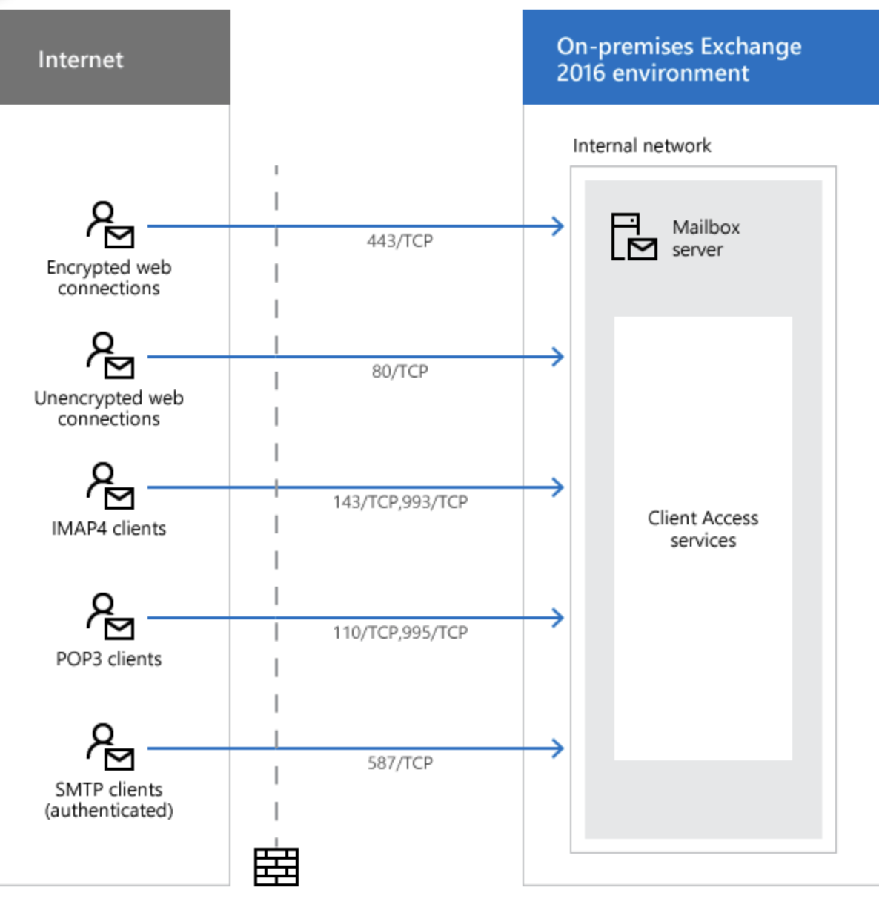
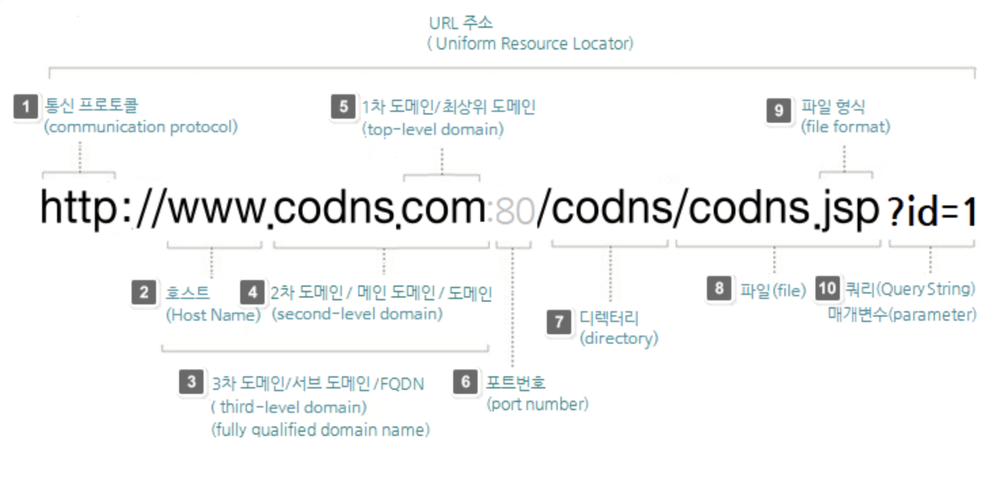
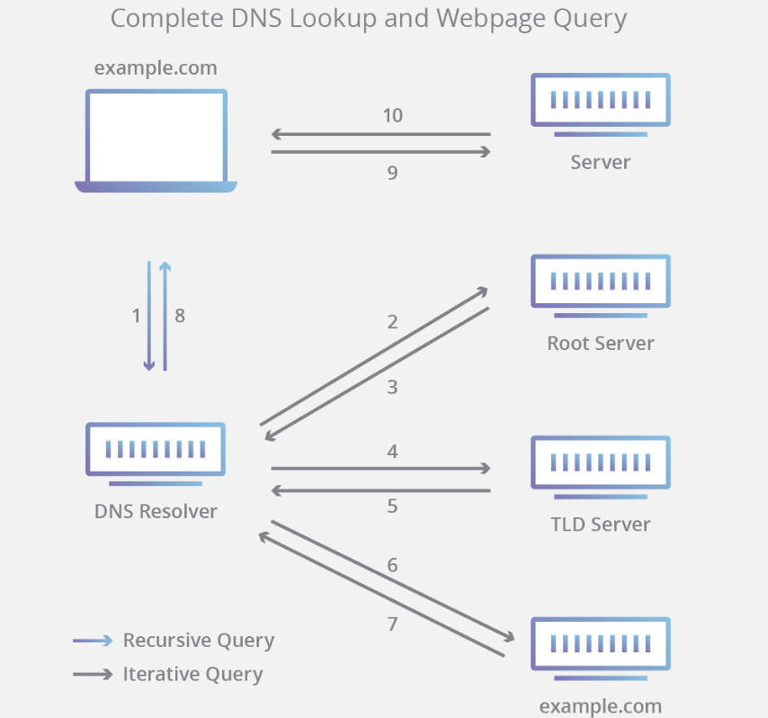

# TCP/IP 4계층의 주요 요소
 </img> 
- TCP/IP 는 현재까지 표준으로 사용하고 있는 규약 모음인 TCP/IP 4계층에서 주요 프로토콜을 간략하게 알아보자

## IP
- 4계층에서 인터넷 계층을 맞는 프로토콜이다.
- 인터넷 상에서 사용하는 주소체계
- 네트워크에 연결된 특정 PC의 주소를 나타내는 체계이다.

### IP 주소 구조
 </img> 
- IP 주소는 8자리의 2진수 4개와 각 사이에 마침표로 구분된 형식을 따른다.
    - 이것은 현재 가장 많이 쓰이는 형식인 IPv4 형식이다.

 </img> 
- IP주소는 네트워크 파트와 호스트 파트로 나뉘는데, 이때, 네트워크 파트가 어디까지인지 나타내는 것이 서브넷 마스크이다. 

### IP 프로토콜 한계
- 비연결성
    - 패킷을 받을 대상이 서비스 불능이어도 상대의 상태를 파악할 수 없어 패킷을 그대로 전송하는 문제가 생김
- 비신뢰성
    - 패킷이 중간에 사라져도 받는 입장에선 알 수 없다.

## TCP vs UDP
- TCP와 UDP는 3계층 전송계층에 위치하며, IP와 응용계층을 중개하는 역할을 한다.
 </img> 

## PORT
 </img> 
- IP 프로토콜만 갖고 `한 IP에서 여러 애플리케이션이 동작할때 특정 어플리케이션을 정해서 통신할 수 없다.`
    - 즉, 어느 서버로 요청을 보내는지 알수가 없다.
- 포트번호는 대상 IP기기의 특정 어플을 정하는 번호이다.
- `포트번호로 receiver를 정해 어떤 서버로 보내는 요청인지 정할 수 있다.`

## URL
### URL 이란?
- 웹에 게시된 어떤 자원을 찾기 위한 브라우저에서 사용되는 메카니즘이다. 
    - HTML이나 이미지 등의 리소스를 특정하기 위한 서식

### URL 구조
 </img> 
|번호|구분|내용|
|--|--|--|
|1|통신 프로토콜|네트워크 상의 서버로부터 웹문서 정보와 이미지 등의 리소스를 받아올 통신 방식을 미리 정해 놓은 것(HTTP,HTTPS,FTP,FILE,MAILTO)| 
|2|호스트|네트워크에 연결된 장치 또는 서버들에 부여되는 고유한 이름으로 호스트 명은 IP 주소나 MAC 주소와 같은 기계적인 이름을 대신하여 일반인이 쉽게 읽고 이해할 수 있는 이름으로 만들어 진다.|
|3|3차 도메인|리소스가 네트워크(인터넷)상에 위치하는 물리적 위치로 Namespace 계층 상에서 최종 호스트 명을 포함하는 도메인 명을 뜻하는 FQDN(Fully Qualified Domain Name)이라고도 하며, 2차 도메인에 WWW와 같이 호스트 명를 부가한 3차 도메인 또는 서브 도메인 이라고도 함|
|4|2차 도메인|일반적으로 도메인 둥록/구매처에서 등록하여 사용하는 도메인을 가리키며 서브 도메인에 대응하여 메인 도메인(또는 zone apex/root domain/naked domain/bare domain)으로 불리기도 하며,3차 도메인과 혼용하여 부르기도 한다.|
|5|최상위 도메인|인터넷에서 도메인 네임의 가장 마지막 부분으로 특정한 조직 계열에 따라 사용되는 도메인. com, net, org, edu, gov, mil등의 일반 최상위 도메인(gTLD)와 co.kr, kr과 같은 국가 코드 최상위 도메인(ccTLD)이 있다.|
|6|포트번호|포트 번호는 네트워크 또는 인터넷을 사용하여 통신하는 각 응용 프로그램 또는 프로세스의 논리 주소로 0에서 65,535번 까지 포트 번호를 사용하며 HTTP 80, HTTPS 443, FTP 21 등이 있다. 위의 URL 예제와 같이 HTTP가 기본 포트인 80번으로 설정된 경우, 80번은 생략될 수 있다.|
|7|디렉터리|해당 파일(또는 자원)이 서버의 어디에 있는지를 나타내는 경로로서 초기의 웹에서는 웹 서버상에서 물리적 파일 위치를 의미하였으나, 최근에는, 실제 물리적 경로를 나타내지 않고, 웹 서버에서 추상화하여 보여준다.|
|8|파일|월드 와이드 웹 상에서 연결 할 실제 파일의 이름으로 HTML(또는 XHTML), CSS 문서, 자바스크립트, 이미지, 문서,동영상 등의 파일을 가리킴|
|9|파일 형식|일반적으로 사용하는 웹 프로그래밍 언어에 따라 달라지며  HTML, CGI, PHP, JSP, ASP 등이 사용된다.|
|10|쿼리 스트링|웹 서버에 제공하는 추가 파라미터로 이 파라미터들은 & 기호로 구분된 키/값으로 짝을 이룬 일련의 쿼리 리스트들로 이루어져 있다.|

## DNS(Domain Name System)
### DNS란
 </img> 
- 도메인 이름과 IP주소를 매칭하는 작업이 있어야, 도메인 이름으로 원하는 사이트로 정확하게 갈 수 있는데,
- DNS는 도메인 이름을 IP주소로 변환하거나 반대의 경우를 수행할 수 있는 데이터베이스 시스템이다.

### DNS 작동 방식
 </img> 
- DNS는 도메인 서버존 이라는 곳에서 도메인을 관리한다.
- 관리대상은 루트 네임 서버,TLD 서버, 권한 있는 네임 서버로 구성된다.
- URL에 www.google.com 주소를 입력하면 `DNS Lookup`이라는 위 그림 같은 과정이 발생한다.
단계 별로 설명하면,
    1. 브라우저가 리졸버에게 IP주소를 요청하면, 리졸버는 입력받은 도메인의 IP 주소를 찾기 위해 우선, 캐시파일을 살펴본다. 있을 시 바로 IP주소를 리턴한다.
    2. DNS 리졸버는 IP주소를 얻기 위해 네임 서버들에게 재귀적인 쿼리를 실행한다.
    3. 찾으면 IP주소를 리턴하고, 찾는 과정에서 기록되지 않은 도메인 네임 서버들의 주소를 저장하기도 한다. 