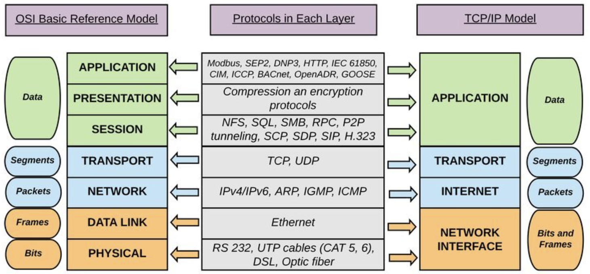

# TCP/IP 기본
- TCP/IP에 대해서 공부하기 이전에, 네트워크를 구성하는 것들을 점진적으로 알아가보자.

## LAN vs WAN
 </img> 

### LAN이란?
- 라우터를 통해, 무선/유선으로 연결된 네트워크
- LAN이 모여 WAN에 구성된다.

### WAN이란?
- 그림에서 볼 수 있듯이, 수많은 LAN들이 모여 구성된 전 지구적 네트워크이다.
- 우리가, 미국에 있는 서버에서 유튜브 영상을 받을 수 있는 이유는 `WAN이라는 거대한 네트워크에 통신사의 광섬유, 위성, 통신탑을 통해 접근 할 수 있기 때문이다.`

## 인터네트워킹(internetworking)이란?
- 네트워크끼리 연결하는 네트워크라는 뜻 -> 네트워크를 확장하기 위함

### 네트워크 확장방법
- 한 네트워크를 확장
- `네트워크와 네트워크를 연결하기 -> 인터네트워킹`

### 장점
- 일부에서 고장이 생겨도 영향이 광범위하게 퍼지지 않는다.
- 불필요한 통신이 네트워크 전체로 확산되지 않는다.
- 개별 네트워크를 각각의 방침에 따라 관리가 가능하다.   
-> 우리가 사용하는 인터넷이 인터네트워킹이다.

## 프로토콜
 </img> 
- 인터넷으로 연결된 컴퓨터끼리 소통시 필요한 약속
- 어떤 컴퓨터든 일관되게 네트워크를 사용할 수 있게 하는 공통 언어

## TCP/IP 계층
 </img> 
- TCP/IP 는 현재까지 표준으로 사용하고 있는 규약 모음으로 각 계층에는 주요 프로토콜이 위 사진과 같이 있다.

## IP 주소 
- 인터넷 상에서 사용하는 주소체계
- 네트워크에 연결된 특정 pc의 주소를 나타내는 체계(양식)를 IP 주소라 한다.

## MAC 주소
- IP 주소 만으로 네트워크 상에서 송수신이 불가하다.
- 이때 네트워크 기기의 제조사에서 할당하는 고유 시리얼인 MAC 주소를 IP주소와 조합해야만 네트워크 통신이 된다.

## 패킷
- 기기끼리 통신에는 회선교환 방식과 패킷교환 방식이 있다.
- 회선교환 -> 음성전화 시스템에 활용됨, 일대일 데이터 교환
- 패킷 교환 -> 여러 상대와 통신가능
### 패킷 교환
 </img> 
- 원본 데이터를 잘게 쪼게서 재포장한 후
- 여러 회선을 활용해 요청한 곳에 보내는 것
- 패킷은 헤더(데이터의 몇번째 데이터인지, 보내는 곳, 목적지에 대한 정보가 담김)
- 데이터로 구성됨