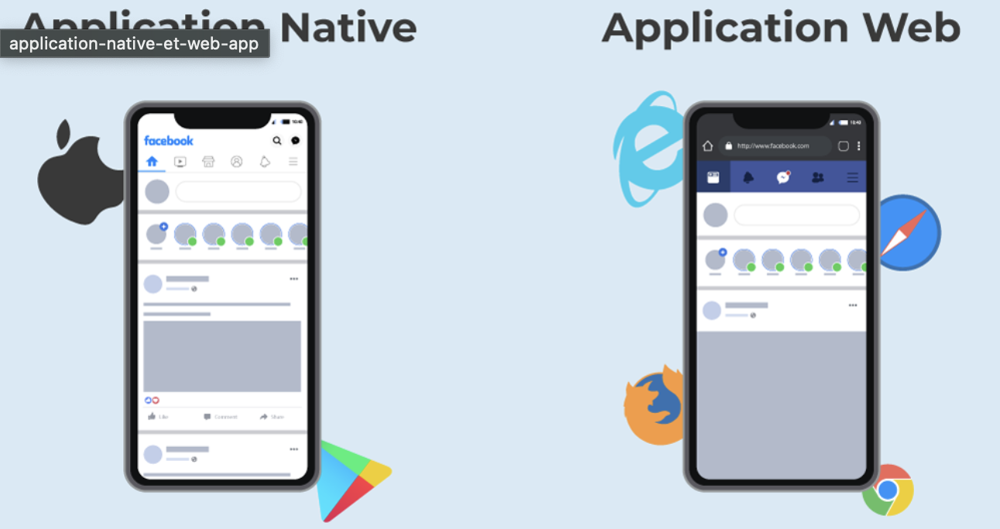

# WebApplication vs NativeApplication

- 웹 애플리케이션에 대한 학습이전에, 네이티브 애플리케이션과 비교하고 넘어가면 이해가 수월하다.

## Native Application
### Native Application이란?
 </img> 
- 특정기기에 설치해서 사용하는 것
    - Apple iOS, Android OS, Windows
- `특정 실행환경에 종속되는 것`

### Native Application 장점
- Web Application 보다 빠르다.
- 설치된 기기의 `시스템/기기의 하드웨어적 리소스에 접근이 수월하다.` 
    - GPS, 카메라, 마이크 등
- 인터넷 없이 사용가능
- Web Application보다 `안전하다.`
    - 구글, iOS 앱스토어의 승인이 되어야 다운/등록이 가능하기 때문
### Native Application 단점
- 개발비가 더들어 간다.
    - 특정 실행환경에 종속되므로, 타 환경을 위한 프로그램을 개발해야 하기 때문(`멀티플랫폼 개발`)
- 위 이유로 인해, 빠른 업데이트가 어렵다.
- 스토어에 승인 받기가 어렵고 비용이 발생한다.

## Web Application이란?
 </img> 
- `정적인 웹사이트의 한계를 벗어나` 다양한 `동적 응답`을 웹브라우저라는 소프트웨어를 통해 가능케 한 애플리케이션이다.
- 쉽게 말해, 웹사이트는 웹페이지라는 정적인 데이터의 모음이다.
- 웹 어플리케이션은 사용자와 웹이 대화가 가능케 한 것이다.

### Web Application 장점
- 브라우저를 통해 실행되기 때문에 설치나 다운로드가 필요없다.
- 업데이트 등 유지 보수가 편하다.
- 네이티브 애플리케이션에 비해 만들기가 수월하다.
- 스토어 승인이 필요없다.
### Web Application 단점
- 인터넷 없이 사용 불가
- 속도가 느리다.
- 사용/다운 받고 싶을때, 찾기가 어려워 접근성이 떨어진다.
- 출처가 불분명한 곳에서 사용할 수 있어, 보안에 취약하다.