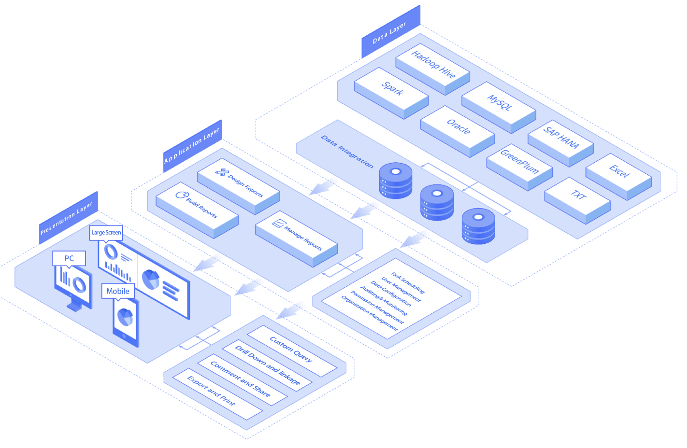

# 웹의 구성

## 웹이란?
- 웹은 인터넷에서 제공되는 하이퍼텍스트 시스템이다.
- 하이퍼텍스트 : 문서안에 다른 문서의 위치정보 등을 포함하여 문서 간의 정보를 서로 연관 지어 참조 할 수 있는 문서.

## 클라이언트-서버 아키텍처
<br></img><br/>
- 클라이언트-서버 아키텍처는 2티어 아키텍처라고도 하며, 리소스를 사용하는 곳(클라이언트)과, 리소스가 존재하는 곳(서버)을 분리 시킨것을 의미한다.
<br></img><br/>
- 3티어 아키텍처에서 서버는 리소스를 전달해 주는 역할만 담당한다. 리소스를 저장하는 공간은 데이터베이스라는 창고에 저장하는데 이런 구조를 3티어 아키텍쳐라 한다.

## 웹 어플리케이션 아키텍처
- 애플리케이션 내부 요소들(브라우저, 유저인터페이스, 미들웨어, 서버, 데이터베이스)이 상호간 소통하는 방식을 설명함
    - `즉, 클라이언트-서버 아키텍처에서 클라이언트와 서버 간의 상호 작용시 내부요소들에 지속적 소통 방식을 표현한 도면이다.`
- 웹 어플리케이션 아키텍처는 웹어플리케이션이 인터넷에 공개되는 순간 엄청난 트래픽에 노출 되기 때문에 웹어플리케이션의 뼈대인 웹어플리케이션 아키텍쳐는 다음 요소를 고려해야한다.
    - 신뢰성, 확장성, 보안성, 견고성

## 웹 애플리케이션의 요청흐름
```
1.https://urclass.codestates.com 로 접속한다고 생각해 보겠습니다.

2.브라우저에 https://urclass.codestates.com 를 입력합니다.

3.브라우저는 URL을 입력 받으면 서버의 주소를 찾기 위해 DNS 서버에 요청을 보냅니다.

4.IP 주소를 찾으면 해당 주소에 HTTPS 요청을 보냅니다. 이미 방문 기록이 캐시 메모리에 있으면 주소를 캐시 메모리에서 가져옵니다.

5.웹서버에 요청이 도착 합니다.

6.웹서버는 저장소에 요청을 보내 페이지 관련 데이터들을 가져옵니다.

7.정보들은 가져오는 중에 비지니스 로직이 작용합니다.

8.비지니스 로직들은 각 데이터들을 어떻게 다룰지가 정해져 있습니다.

9.로직들을 통해 요청 받은 데이터들이 처리되고 브라우저에 응답합니다.

10.요청들이 브라우저에 응답으로 돌아왔을 때, web page 화면에서 출력됩니다.

```

## 웹 애플리케이션의 요소들
- 유저 인터페이스 요소 : 화면출력, 로그, 알림, 환경 설정 등 웹 애플리케이션의 기능적인 부분 외적인 요소
- 구조 요소 : 웹 어플리케이션의 기능적인 부분을 담당함. 유저와 상호작용, 제어, 데이터베이스 등과 관련된 것. 구조 요소는 웹브라우저, 클라이언트, 웹애플리케이션 서버, 데이터 베이스로 이루어져 있다.

## 웹 애플리케이션의 3단계 계층 구조
<br></img><br/>
- Presentation Layer: 이 계층은 `유저와 브라우저 등을 이용해 직접적으로 접촉을 한다.` Web Server가 이 영역에 포함되며, 유저 인터페이스 요소들을 포함한다.

- Application Layer: Business Layer, Business Logic 혹은 Domain Logic이라고 불리기도 하는 이 영역은 유저의 요청을 브라우저로부터 받아서 처리를 한다. Application Server가 이 계층에 포함되며 또한, `데이터 접근을 위한 경로를 규격화 하는 등의 과정이 이 계층에 작성이 된다.`
- Data access layer: Persistence layer라고도 불리는 이 계층은 애플리케이선의 데이터 저장소에 접근하여 데이터를 불러 오거나 저장을 담당. `Application Layer 는 이 계층과 밀접한 연관을 가지고 있다. 이 단계를 통해 Application Layer 의 로직들은 어느 데이터베이스에 접근해서 데이터를 회수하고 혹은 저장할지를 더 최적화 할 수 있다.`

## 웹 애플리케이션 구현방식
1. Single Page Application : 유저의 입력과 요청에 의한 콘텐츠나 정보의 최신화가 페이지 새로고침 없이 현재 페이지에서 이루어진다. 이 점으로 인해, 유저 경험이 극대화 된다.
2. Microservice architecture : 작고 가벼운 특정한 한가지 기능에 집중한 웹 애플리케이션이다. 각 애플리케이션의 기능 요소들은 상호간 독립적이므로, 같은 개발언어를 쓸 필요가 없다. 따라서, 개발자는 원하는 언어를 사용해 기능 개발에 유연성을 더 갖게 되고, 개발 과정의 전반적인 속도와 생산성이 향상된다.
3. Sercerless architecture : 개발자가 웹 애플리케이션의 서버와 기타 기반 기능들에 대해 외부의 3자인 클라우드 서비스 제공자에 의탁하는 방식이다. 이 방식은 기본적인 서버나, 기반 기능에 대해 걱정할 필요 없이 개발에 집중할 수 있게 한다.

## HTTP(HyperText Transfer Protocol)
- 웹 브라우저상에서 `클라이언트와 서버간의 통신을 담당하는 프로토콜`이다.
- HTTP는 `클라이언트의 데이터 요청과 서버에서 요청에 대한 응답을 반복하면서 웹 애플리케이션을 작동시킨다.`

## Cookie와 Session
- 이 둘은 HTTP의 무상태성을 보완하는데 사용되면, 각각은 아래와 같은 특징을 갖는다.
쿠키: 웹 애플리케이션을 사용하는 유저의 정보를 클라이언트에 보관하고, 다음 접속부터는 유저의 정보를 클라이언트가 서버로 보내서 유저를 서버가 식별하게 한다. 쿠키에 담긴 내용으로 웹 애플리케이션에 유저가 설정했던 항목들에 대해 저장을 해서 다음에 이어서 같은 방식으로 작동하게 도와준다.

- 세션: 세션의 경우 서버에 Session-Id 라는 고유 아이디를 할당해서 유저를 식별한다. 단순하고 유출이 되면 안되는 정보는 서버에서 관리를 하면서 세션 ID와 매칭해서 저장해 관리한다. 주로 사용되는 방법은, 세션정보는 쿠키에서 관리하고, 실제 매칭되는 값들은 서버 측에서 관리하는 것이 일반적

## SSR 과 CSR
### SSR이란? (Server Side Rendering)
<br></img><br/>
- 자바스크립트가 웹페이지를 서버에서 렌더링 하는 방식.
- 브라우저가 서버의 GET요청을 할때, 만약 데이터베이스의 데이터가 필요하면, 서버는 데이터를 불러와서 `완전 렌더링 후 웹 페이지 파일을 브라우저로 전송한다.`

### SSR 사용
- SEO(Search Engine Optimization=검색엔진최적화)가 우선인 경우 사용
- 첫 화면 렌더링이 빠르게 필요한 경우, 단일 파일 용량이 작은 SSR을 사용
- 상호작용이 적은 웹페이지일때,

### SSR 단점
- 자원이용이 서버에 집중되어 애플리케이션 유비지용이 높다.

### CSR이란? (Client Side Rendering)
<br></img><br/>
- 자바스크립트가 웹페이지를 클라이언트에서 렌더링 하는 방식.
- 브라우저의 요청을 서버로 보내면 서버는 웹페이지의 골격이 될 단일 페이지를 클라이언트에 보낸다. 이때 서버는 웹페이지와 함께 자바스크립트를 보낸다.
- 골격과 자바스크립트를 클라이언트에서 받아 렌더링한다.
- 브라우저가 다른경로로 이동시 SSR과 다르게 서버가 웹페이지(골격)을 다시 보내지 않는다. CSR에서는 경로에 따라 페이지를 다시 렌더링만한다. 따라서, 웹페이지 파일은 처음과 같다.

### CSR 사용
- SEO(Search Engine Optimization=검색엔진최적화)가 우선이 아닐때,
- 상호작용이 많을떄.

### CSR 단점
- 클라이언트에서 렌더링은 느린 속도를 사용자에서 줄 수 있다.
- 검색엔진에 노출이 안된다.

## AJAX(Asynchronous JavaScript And XMLHttpRequest)
- SPA를 만드는 기술로써, 웹페이지에 필요한 부분에 필요한 데이터만 `비동기적`으로 받아와 화면에 그려낼 수 있는 기술이다.
- 비동기적이란 말의 뜻은, 사용자가 a라는 작업을 하면서, b를 하는데, 이때, a,b가 독립적으로 움직인다는 얘기다. 
- `AJAX에서 비동기는 원래 데이터를 받아오게 되면, 새로운 페이지로 이동해야 하는데, 페이지를 이동하지 않고, 현재 페이지를 보면서, 새로운 데이터를 받아오는 것이다.`
    - 이것을 가능하게 하는 것이 Fetch 이다.

### AJAX 장점
- 서버에서 HTML을 완성해서 보내지 않아도 웹페이지를 만들 수 있다. <- 필요한 데이터를 비동기적으로 가져와서 일부만 업데이트하면 된다.
- XHR이 표준화 됨에 따라 브라우저에 상관없이 사용할 수 있게되어 범용성이 확보되었다.
- 필요한 부분만 렌더링 하기 때문에 빠르고, 많은 상호작용이 가능하다.
- 필요한 부분만 데이터를 받기 때문에 비교적 데이터 크기가 작다.

### AJAX 단점
- SEO에서 불리하다.

