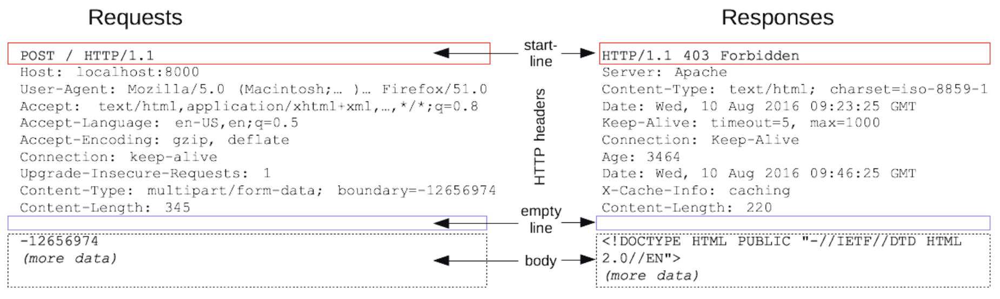

# HTTP(HyperText Transfer Protocol)
- HTML과 같은 문서를 전송하기 위한 Application Layer 프로토콜이다.
- HTTP는 웹브라우저와 웹서버 소통을 위해 디자인되었다.
- 전통적 클라이언트-서버 모델에서 클라이언트가 HTTP Messages 양식에 맞춰 요청을 보내면, 서버도 HTTP Messages 양식에 맞춰서 응답한다.

## HTTP Messages
- 클라이언트와 서버 사이에서 데이터가 교환하는 방식으로 유형으로 `요청(request)과 응답(reponse)이있다.`
- 개발자는 HTTP 메시지를 직접 작성할 필요가 없다.

### HTTP Messages 구조
 </img> 
1. start line : 요청이나 응답의 상태(응답에선 status line 이라함)
2. HTTP headers : 요청을 지정하거나, 메시지에 포함된 본문을 설명하는 헤더 집합
3. empty line : 헤더와 본문을 구분하는 빈줄
4. body : 요청에 대한 데이터, 문서

### HTTP request 구조
1. start line : 수행할 `작업(GET, PUT, POST 등)이나 방식(HEAD or OPTIONS)`을 설명하는 HTTP method를 나타낸다.
2. header : 
    - General headers : 메시지 전체에 적용되는 헤더
    - Request headers : fetch를 통해 가져올 `리소스나 클라이언트 자체에 대한 자세한 정보를 포함하는 헤더`
    - Representation headers : 바디에 담긴 리소스의 정보(콘텐츠 길이 등)를 포함
3. Body :
    - 데이터를 업데이트를 위해 사용하는 부분으로(POST, PUT에서 사용됨) GET, HEAD, DELETE, OPTIONS는 바디가 필요없음

### HTTP respose 구조
1. status line : 현재 `프로토콜 버전, 요청 결과, 상태 텍스트를 포함`
2. header : 
    - General headers : 메시지 전체에 적용되는 헤더
    - Request headers : 위`치 또는 서버 자체에 대한 정보(이름, 버전 등)와` 같이 응답에 대한 부가적인 정보를 갖는 헤더
    - Representation headers : 바디에 담긴 리소스의 정보(콘텐츠 길이 등)를 포함
3. Body :
    - 데이터를 업데이트를 위해 사용하는 부분으로(POST, PUT에서 사용됨) GET, HEAD, DELETE, OPTIONS는 바디가 필요없음

### `상태성`
- 예를 들어, 노트북을 구매하는 과정이 다음과 같다고 가정해보자
    1. 점원에게 가격 문의
    2. 구매 수량 입력
    3. 결제 방식 선택
- 위 상황에서 상태성은, `클라이언트가 각 요청을 위처럼 단계별로 하는 것이다. 그때, 서버는 각 단계를 기억하고 있는 상태를 상태성이라고 한다.`
- 근데 문제는 이때, 서버하나가 고장나서 다른 서버가 요청을 처리 한다고 하자. 
    - 예를 들어 구매 수량 까지 클라이언트 요청을 처리하다가 결제 방식 선택 전에 원래 서버가 죽었다. 
    - 그래서 다른 서버가 결제 방식 선택을 처리해주려고 하는데, 앞전 고객 상태를 알지 못하게 되서, 고객이 첨부터 다시 요청해야하는 현상이 생긴다.
- 정리하면, 상태성은 다음과 같이 정리된다.
    - `고객 요청 단계가 모두 종료되기전에 서버가 고장나면, 고객은 처음부터 요청해야한다.`
    - 요청의 단계가 복잡해질 수 록 `연산에 필요한 것을 업그레이드 해야하므로 비용이 많이 든다.`
    - `서버가 항상 기억해야하는 회원정보, 회원등록 같은 것을 담당하는 부분은 상태성이 있어야한다.`

### HTTP 무상태성
- 상태를 가지지 않는다는 뜻으로, HTTP가 서버나 클라이언트의 상태 변화를 체크하지 않는다는 뜻이다.
- 말로만 표현하면 어렵다.
- 앞선 예시에서 3개의 단계가 무상태성에 오면, 고객은 `무조건 요청을 저 3단계를 통합해서 준다.`
    - 노트북 가격얼마에요? 두개 살께요 카드로 결제하구요.
- 이렇게 오면, 본래 담당하던 서비스가 터져도, 다른 서버가 맡을때, 고객 요청처리에 이상없이 할 수 있다.
- `그렇기 때문에, 이벤트나, 수강신청, 티켓팅 까지 서버에 트래픽이 커져도 컴퓨터만 늘리면 되므로 비용이 저렴하다.`
- `보통은 서비스가 무상태성을 갖게 보편적으로 만든다. 다만 위에 얘기한것 처럼 고객정보 처럼 꼭 기억하는 것은 제외다.`

## HTTP를 이용한 클라이언트-서버 통신과 API
- 웹 어플리케이션 아키텍처에서는 클라이언트와 서버가 서로 HTTP라는 프로토콜을 이용해 서로 대화를 나눈다. 이때, 클라이언트가 서버에 데이터, 리소스를 잘 요청할 수 있게 안내하는 역할을 하는 것이 API이다.

- 더 알아보기
    - REST API
    - HTTP method
    - CORS