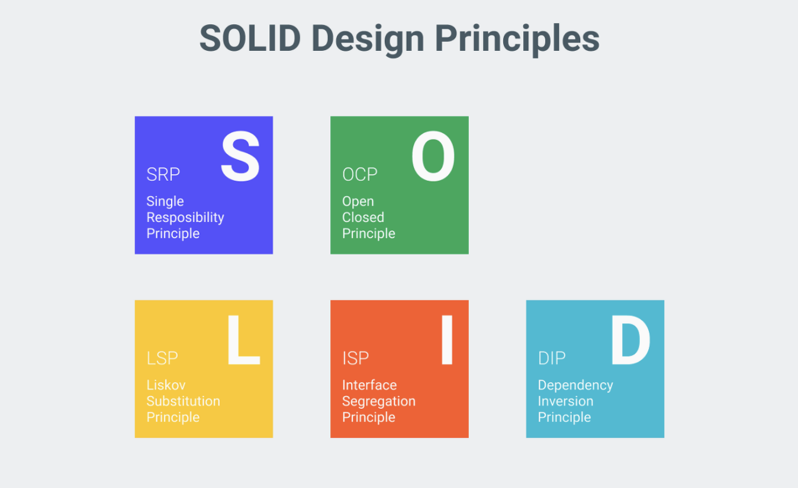
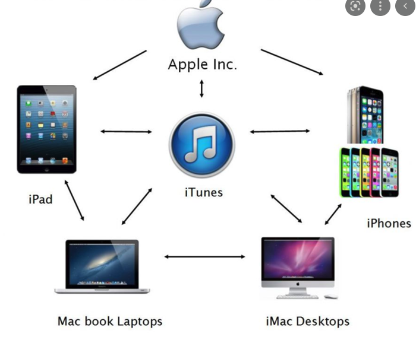
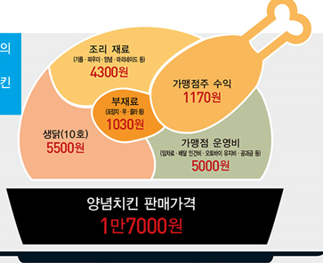

# 좋은 객체 지향 설계의 5가지 원칙 (SOLID)

 </img> 

## SRP 단일 책임 원칙 (Single Resposibility Principle)
- 한 클래스는 하나의 책임만 가져야 한다.
- 하나의 책임이라는 것은 모호하다. ex) 책임 1. 소리를 출력하라-> 책임 1-1. 저음을 처리하는 방법, 책임 1-2. 외부소음을 차단하라 등등 
- `핵심 기준은 변경했을때, 파급효과가 적으면 SRP를 잘 따르는 것`  
    - 소리를 출력하라는 책임으로 클래스를 나누지 말고, 소리 출력부, 저음처리부, 외부소음 차단 각각 책임을 나눠서 클래스를 만드는 것이 바람직 하다.

 

## OCP 개방-폐쇄 원칙 (Open/Closed Principle)
- 소프트웨어 요소는 확장에는 열려 있으나 변경에는 닫혀 있어야 한다.
- `처음에 가장 상상이 안되는 원칙이다. 확장이란 말이 곧 변경한다는 얘기인데, 확장은 되나 변경은 하지 말라니 무슨 소리야?`
- 다형성을 적용해서 먼저 실생활에서 OCP를 이해해보자
    - 다형성의 핵심 개념은 역할과 구현이라고 했다.
    - 이어폰이 필요한 사용자는 이어폰이라는 역할(전자기기와 연결 및 소리전달)을 하는 여러 선택지 중 하나만 고민하면되지, 역할을 할까?에 대한 걱정이나, 사용방법에 대한 걱정은 안해도 된다.
    - 여러개의 이어폰은 즉, 구현체가 여러개 이기때문에, 구현의 확장에는 열려있다는 것을 의미한다.
    - 이때, 이어폰에 본래 역할과 기본 사용법에 대한 것은 변경이 없다. 즉, 폐쇄는 역할은 변하지 말아야한다는 의도다.
- 이번에는 프로그래밍쪽에서 OCP를 이해해보자.
    - 아직 어떤 데이터베이스를 쓸지 정하지 못한 서비스가 있을때, 기본적으로 데이터를 저장한다는(역할) 인터페이스는 변화가 없지만, 저장하는 방법은 메모리에 저장, mySql로 저장 등등의 구현의 확장에는 열려 있다. 
    - 개념상은 맞지만, 물론 이때, 클라이언트 코드에서, `어떤 데이터베이스를 쓸지 구현체의 생성을 하게 되면, 결국 데이터베이스 변경시 클라인트를 변경해야 하므로, OCP가 깨진다.`
    - 스프링은 객체를 생성하고, 연관관계를 맺어주는 작업을 해줘서 클라이언트에 코드 변경없이 구현의 확장이 가능하게 하고 결과적으로 OCP를 가능케 한다.

 

## LSP 리스코프 치환 원칙 (Liskov Substitution Principle)
 </img> 
- 프로그램의 객체는 프로그램의 정확성을 깨뜨리지 않으면서 하위 타입의 인스턴스로 바꿀 수 있어야한다.
- 다형성에서 하위 클래스는 인터페이스 규약을 다 지켜야 한다는 것, 다형성을 지원하기 위한 원칙, 인터페이스를 구현한 구현체를 믿고 사용하려면, 이 원칙이 필요하다.
- 역시 추상적인건 자기만 이해하려고 쓴건지 이해가 안간다. 주성치의 청개구리 총으로 이해해보자
    - 방아쇠를 당기면 어떤 일이 벌어지는가? 총구 방향으로 총알이 상대에게 꽂혀야한다.
    - 총에는 반드시 그래야 하는 규약이 바로 방아쇠를 당기면 총알이 앞으로 나가라는 것이다.
    - 이 규약은 프로그램에서 인터페이스 규약과 같은 것이다.
    - 총의 인터페이스에서 확장한 권총 기관총 저격용 총, 대포 등은 모두 그 규약을 따른다.
    - 근데 이 청개구리 총을 보자, 지 멋대로 앞으로 쐇다 뒤로 쐇다. 사용자가 안맞을라고 총구를  자기쪽으로 뒀더니 이번엔 총구에서 발사가 된다 ㅋㅋㅋ
    - `리스코프 치환 원칙은 이 청개구리 총 같은게 없어야 된다는 것이다. 인터페이스를 기반으로 구현 했으면, 그 규약을 정확히 지켜야, 사용하는 클라이언트도 그걸 믿고 사용할 수 있기때문이다.`

 

## ISP 인터페이스 분리 원칙 (Interface segregation Principle)
 </img> 
- SRP와 비슷한 개념으로, 특정 클라이언트를 위한 인터페이스 여러 개가 범용 인터페이스 하나보다 낫다 하는 것이다. 
- 이번 예로 애플 생태계를 보자. 
    - 애플 안에 아이폰, 아이패드, 맥북, 아이맥은 사실 인터넷 되고, 통화되고 영상되고, 기능의 차이를 느낄 수 없다.
    - 프로그램적 표현으로는 역할(인터페이스)이 동일하다고 봐도 된다. 
    - 하지만, 클라이언트 기준으로 나눌 수 있으니까, 인터페이스가 여러 개가 된 것이다.
    - 특정 클라이언트를 나눠보자.
        - 기본 애플 역할(인터페이스) : 인터넷, 통화가 가능한 기기
        - 아이폰 역할 : `소지하면서` 통화와 인터넷이 가능한 기기-> `소지라는 역할 추가`
        - 아이패드 역할 : `필기가 가능`, 통화와 인터넷이 가능한 기기 -> `필기라는 역할 추가`
        - 아이맥 역할 : `키보드 처럼 타이피이 가능`, 통화와 인터넷이 가능한 기기 -> `타이핑이란 역할 추가`
        - 맥북 역할 : `소지와 타이핑이 가능한`, 통화와 인터넷이 가능한 기기 -> `이동과 타이핑 역할 추가`
    - 위와 같이 애플 생태계 인터페이스에 공통 역할인 통화와 인터넷은 갖고 있지만, 클라이언트 기준으로 완전 서로 다른역할이 추가된것을 볼 수 있다.
    - `이런 상황에서는 애플 생태계 기본 인터페이스에 저 모든 기능을 추가하면, 정말 쓰지도 않는데 추가된 것이기 때문에, 하드웨어 낭비가 된다.`
    - `그렇기 때문에, 범용 인터페이스가 아니라 여러 인터페이스가 낫다라는 원칙이다.` 크으 예시 적절했다.!

 

## DIP 의존관계 역전 원칙 (Dependency Inversion Principle)
 </img> 
- 이 개념은 OCP만큼 중요한 원칙이다.
- 프로그래머는 `추상화에 의존해야지, 구체화에 의존하면 안된다.` 의존성 주입은 이 원칙을 따르는 방법 중 하나다.
- 쉽게 이야기해서 클라이언트가 구현 클래스에 의존하지 말고, 인터페이스에 의존하라는 뜻
- 앞에서 말한 `역할에 의존하게 해야한다`, 객체 세상도 클라이언트가 인터페이스에 의존해야 유연하게 구현체를 변경할 수 있다! 구현체에 의존하게 되면 변경이 아주 어려워진다.
- 예로 치킨집 사장님을 들어보자.
    - 김윙봉 사장님은 프랜차이즈 치킨집 창업주다.  
    - 그런데 요즘 더위 때문에, 닭 원가가 많이 올랐다.
    - 그의 와이프 박순살씨는 남편이 닭이 원가가 올랐다는데도 태연한게 맘에 안든다.
    - 그래서 한날 남편은 철이 없다며, 꾸지럼을 주니, 김윙봉이 하는말
    - `나는 닭튀기는 레시피만 따라하면 되지, 닭을 어디서 구해오든 씻든 잘라오든 내가 알바 아냐!`
    - `그렇다! 윙봉씨는 닭튀는기 레시피(=추상화)에만 신경쓰면되지, 구체적인 닭, 양념, 기름을 공수하기 위해 시장에 가서 이것저것 살펴볼 필요가 없다.`
    - `프랜차이즈 본사가 원가가 오르던 어떻게든 17000원에 한마리 팔면 5000원 남기게 다 조건을 맞추기 위해 해준다. `
