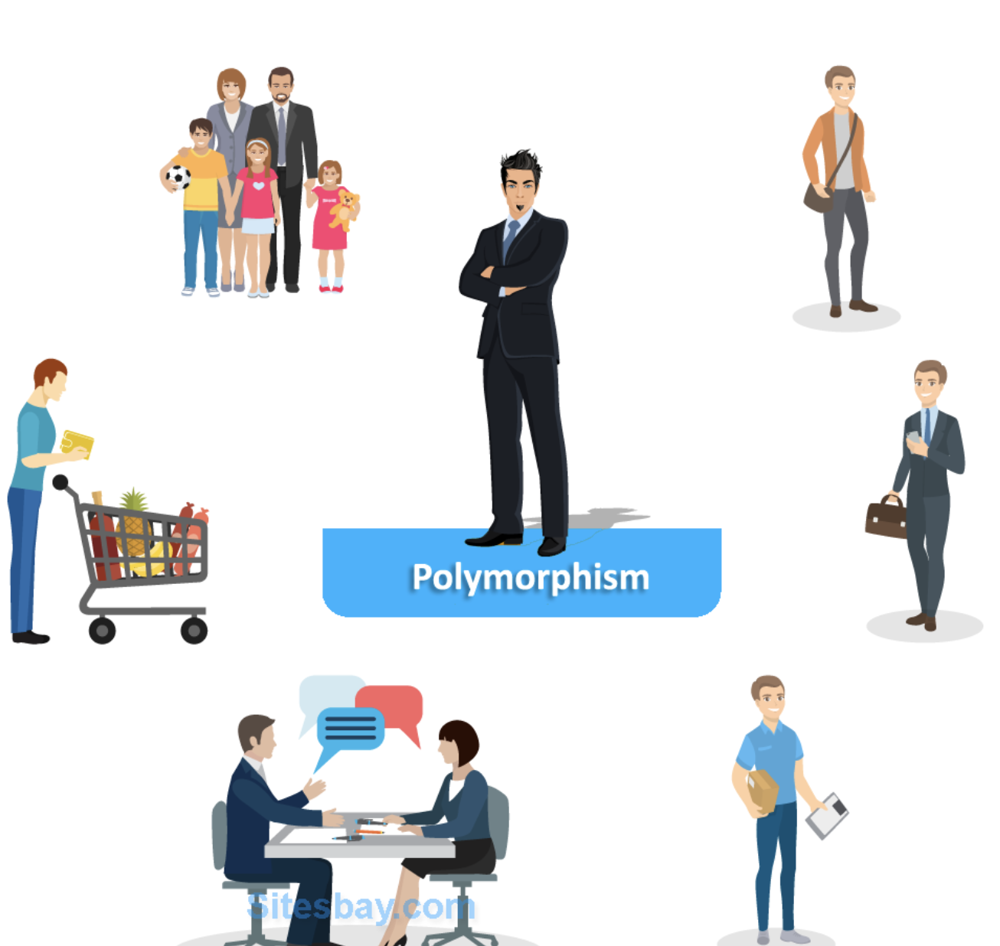
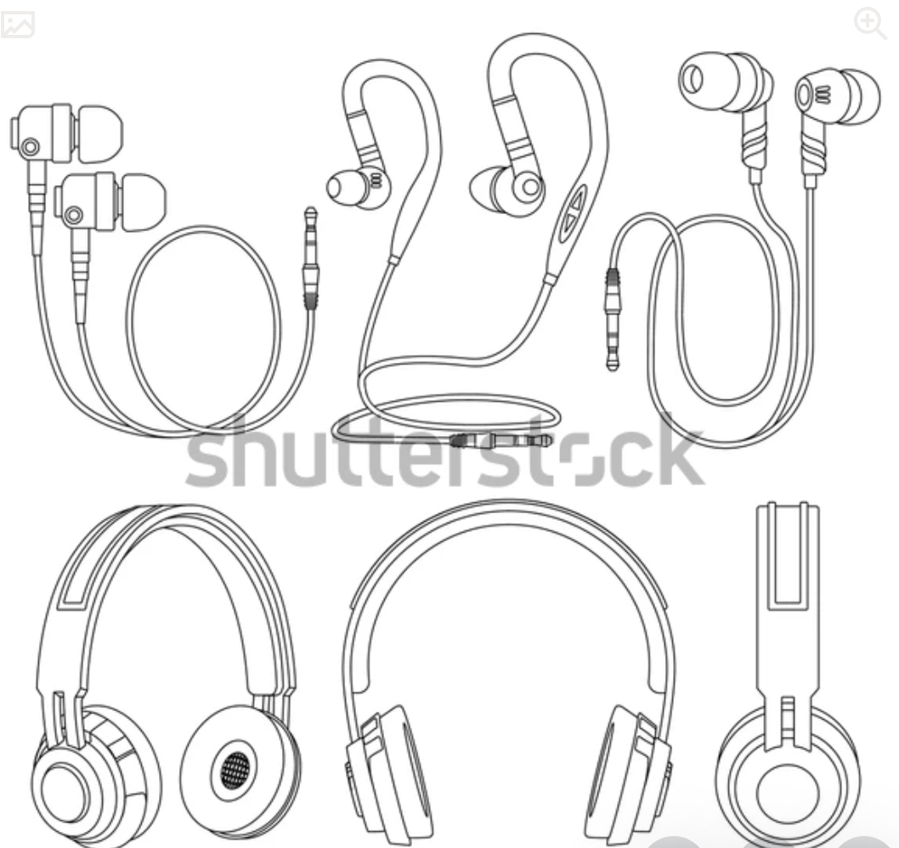

# 스프링은 왜만들었나?
## 스프링 등장배경
1. 이전 기술은 EJB는 EJB에 너무 의존적이고 종속적인 개발을 해야했다.
    - 이로 인해, Java의 객체지향 특징을 살리지 못하는 단점이 있었다.
2. POJO(Plain Old Java Object) 처럼 프레임워크에 종속된 방식을 탈출하자는 주장이 나온 배경이다.

## 스프링 핵심 컨샙
1. 스프링은 자바 언어 기반의 프레임워크
2. 자바의 가장 큰 특징인 `객체지향을 살려내는 프레임워크`
3. 스프링은 `좋은 객체 지향 애플리케이션을 개발할 수 있게 도와주는 프레임워크`

# 좋은 개체 지향 프로그래밍

## 객체 지향 프로그래밍?(Object Oriented Programming)
- 객체 지향 프로그램은 기존 절차지향에서 처럼 컴퓨터 프로그램을 명령어의 목록으로 보는 것이 아닌, `객체들의 모임, 객체들의 소통 및 협력을 통해 데이터를 처리 하는 방식이다.`
- 객체 지향 프로그램은 프로그램을 유연하고 변경이 용이하게 만들기 때문에, 대규모 소프트웨어 개발에 많이 사용된다.

## 유연하고, 변경에 용이하다?
 </img> 
- 이 말은 객체지향의 핵심적인 특징을 표현하며, 줄여서 `다형성이라고 표현할 수 있다.`
    - 마치, 레고 조립하듯
    - 키보드, 마우스 갈아 끼우듯
    - 컴퓨터 부품 갈아 끼우듯
    - `프로그램에서 컴포넌트를 쉽고 유연하게 변경하면서 개발할 수 있는 것이 다형성이다.`

## 다형성(Polymorphism)
- 다형성은 앞에서 본 것처럼 휴대폰을 갤럭시에서 아이폰으로 바꾸듯, 신발을 나이키에서 아디다스를 바꾸는 것 처럼 사용자(나)가 객체의 역할(전화용, 발보호) 및 사용방법만 알면, 그 구체화하는 것이 나이키든, 아디다스던 상관없이 사용할 수 있는것에 비유될 수 있다.
- 정리하면, 다형성을 `역할(인터페이스)`과 `구현(인터페이스를 구현한 객체)`으로 나눠서 이해 할 계획이다.

## 역할과 구현을 분리 
 </img> 
- 이어폰의 예로 역할과 구현을 분리하고, 다형성을 이해해보자.
- 이어폰의 역할, 사용법
    - 역할 : 전자기기의 소리출력을 담당
    - 사용법 : 전자기기와 연결해서 귀에 꽂으면 소리가 들린다.
- 위에 이어폰의 역할과 사용법은 이어폰은 이런 `역할과 이렇게 해야 쓸수 있다는 것을 추상적으로 나타낸다.`
- 이어폰을 구현하는 것은 바로 이어폰의 역할과 사용법이 추상적이기 때문에 다양해 질 수 있다. `특히, 역할(가장 본질적 존재이유)은 딱 고정되어 있지만, 사용법을 충족 시키는 방법은 다양하게 구현될 수 있다.`
    - 이어폰 사용법 구현 포인트
        - 전자기기와 연결 : 블루투스, 직접 기기와 연결, 와이파이로 연결
        - 사용자에게 음향 전달 : 커널, 무커널, 헤드셋, 귀밑에 진동으로 전달
        - 음향 조절 : 리모콘, 이어폰에 모션, 휴대폰으로만 전달
- 정리
    - 사례를 정리해서 다형성을 보면, `사용자(개발자)는 이어폰의 역할(인터페이스)만 알 면된다. 전자기기와 연결에서 소리들을 무언가가 필요하면, 인터넷에 이어폰이라고 검색하면 된다.`
    - 사용자는 소리가 어떻게 출력되는지, 연결방법, 커널하고, 무커널의 소리전달 방식과 같은 내부 구조를 몰라도 된다.
    - 블루투스 이어폰이던, 헤드셋이던 클라이언트(사용자)는 내부 구조가 변경되어도 소리를 듣는다는 본래 역할에는 변화가 없다.
    - 따라서, 자꾸 같은 역할을 하는 기기를 여러개를 사도, 아무 무리 없이 사용할 수 있다. -> 이 점이 다형성에 핵심이다.

## 자바에서 다형성
- 오버라이딩을 떠올려보자.
- 인터페이스 내부를 뜯어서 생각해보자.
    - 우선, 추상메소드가 존재한다. 이 추상메소드는 반환 타입, 이름, 매개변수 외에 그래서 그걸 갖고 멀 할 껀지가 나와 있지 않다.
        - 이 점은 이어폰에서 이어폰의 역할(소리를 듣는다)만 알려주고, 블루투스인지, 선 연결인지는 알아서 만들어란 것과 같다.
    - 상수 필드가 존재할 수 있다. 이어폰의 역할에서 핵심은 소리와 전자기기와 연결에 대한 설정값을 의미한다.
- 역할만 명시해둔 인터페이스를 근간으로, 개발자는 오버라이딩을 해서, 다양한 연결방식, 귀에 꽂는 방식을 다양하게 만들어서 이어폰을 출시한다.

## 다형성의 본질
- 인터페이스를 구현한 객체 인스턴스를 실행 시점에 유연하게 변경할 수 있다.
- 다형성의 본질은 협력이라는 객체사이의 관계에서 시작해야함
- `클라이언트를 변경하지 않고, 서버의 구현기능을 유연하게 변경할 수 있다.`
- `인터페이스를 가장 변화가 없이 설계하는 것 = 인터페이스를 안정적으로 설계`가 가장 중요하다.
    - 예로 들어, 220v에서 갑자기 다 110v로 바꾼다면, 어마한 비용이 들것이다. 

## 마무리 - 스프링과 객체 지향
- 스프링은 사실 다형성을 가장 잘 이용할 수 있게 도와주는 프레임워크다.
- 제어의 역전(Ioc), 의존관계 주입(DI)은 다형성을 활용해서 역할과 구현을 편리하게 다룰 수 있도록 지원한다.